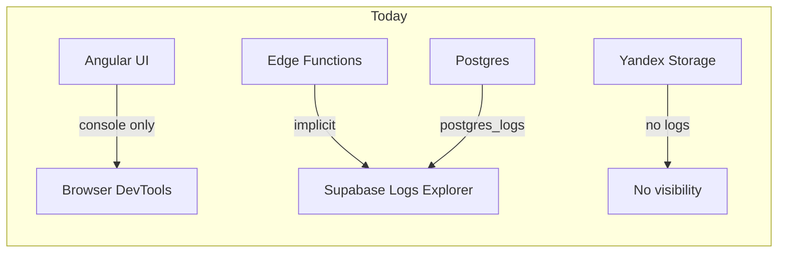
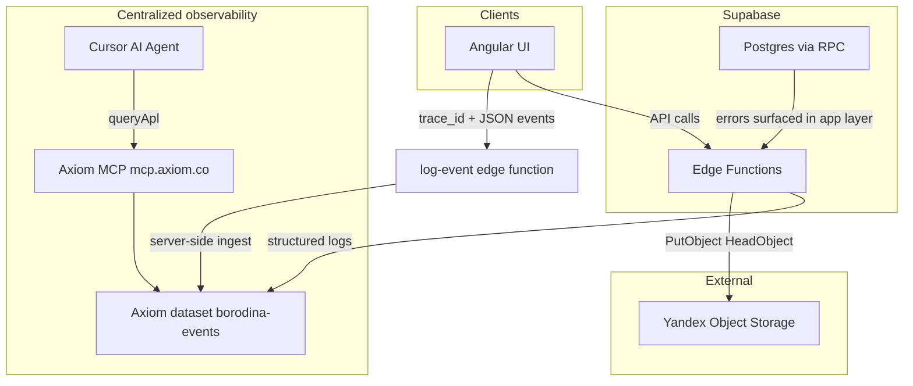

# Centralized Logging Recommendation for Borodina-library

## Current state

Your project has **no structured logging today**:

- UI: only 2 `console.*` calls ([`main.ts`](FictioneersUI/src/main.ts), [`auth.service.ts`](FictioneersUI/src/app/core/services/auth.service.ts)); Angular global error listeners only ([`app.config.ts`](FictioneersUI/src/app/app.config.ts))
- Edge function [`upload-book-cover/index.ts`](supabase/functions/upload-book-cover/index.ts): JSON error responses, no structured logs
- Supabase Dashboard logs exist but are **fragmented by product** (auth, postgres, edge, storage) with **short retention** (1 day free / 7 days Pro)
- Yandex Object Storage has **no client-side logging**; operations happen only inside the edge function
- [`security_report.md`](Documents/security_report.md) already flags monitoring as **Weak**



---

## What you need (mapped to requirements)

| Requirement | What to use |
|-------------|-------------|
| Log levels (`debug`/`info`/`warn`/`error`) | Shared logger wrapper in UI + Edge Functions |
| Centralized storage + expiration | Hosted log platform with retention policy |
| Structured JSON | One canonical event schema, `JSON.stringify` everywhere |
| Cross-tier analysis | `trace_id` propagated UI → Edge → storage ops |
| AI agent analysis | Platform with **hosted MCP** (best fit: **Axiom** or **Grafana Cloud**) |

---

## Primary recommendation: Axiom + thin app loggers

**Why Axiom fits this project best**

1. **Native hosted MCP** at `https://mcp.axiom.co/mcp` — Cursor can query logs with `queryApl`, list datasets/schemas, inspect monitors (no self-hosted MCP server)
2. **JSON events** ingested over HTTP; no agents required
3. **Free Personal tier**: 500 GB/month ingest, **30-day retention**, 3 datasets — more than enough for a library MVP
4. Works with your split hosting: GitHub Pages UI + Supabase Cloud + Yandex (no YC compute required)
5. Paid upgrade allows **custom retention** beyond 30 days

**Why not Yandex Cloud Logging as the central store**

You already use Yandex only for **Object Storage**, not for compute. YC Logging is designed for YC-managed services (VMs, functions, LB). Wiring Angular + Supabase into it adds friction and has **no first-class MCP** for Cursor. Log Yandex Storage **operations** from your edge function into Axiom instead.

**Why not Supabase Logs alone**

Supabase Logs Explorer is valuable but:
- Retention is short (1–7 days on typical plans)
- Logs are **split across tables** (`auth_logs`, `function_logs`, `postgres_logs`, etc.)
- **Log Drains** to external systems require Pro + ~$60/mo per drain
- No MCP integration for AI analysis

Keep Supabase logs as a **secondary/debug** source, not your system of record.

---

## Target architecture



### Canonical JSON event schema (all tiers)

Use one shape so AI and humans can correlate:

```json
{
  "level": "error",
  "service": "ui | edge-upload-cover | supabase-db",
  "event": "cover_upload_failed",
  "trace_id": "uuid-v4",
  "user_id": "uuid-or-null",
  "route": "/books/new",
  "book_id": "uuid-or-null",
  "duration_ms": 412,
  "message": "Yandex PutObject failed",
  "error": { "name": "S3ServiceException", "code": "AccessDenied" },
  "meta": {}
}
```

**Rules**
- Never log passwords, JWTs, or Yandex secrets
- Hash or omit PII in UI logs; include `user_id` only when authenticated
- Generate `trace_id` in UI per user action; pass as `X-Trace-Id` to edge functions

---

## Instrumentation by layer

### 1. Angular UI ([`FictioneersUI/`](FictioneersUI/))

| Piece | Library / approach | Purpose |
|-------|-------------------|---------|
| Logger service | Small custom `LoggingService` (levels + JSON builder) | Consistent schema, sampling for `debug` |
| Global errors | `ErrorHandler` provider | Uncaught exceptions → `level: error` |
| HTTP failures | Optional interceptor on Supabase/fetch calls | Network + 4xx/5xx with `trace_id` |
| Bootstrap | Replace `console.error` in [`main.ts`](FictioneersUI/src/main.ts) | Structured boot failures |

**Do not** put a full Axiom API token in the GitHub Pages bundle. Two secure options:

- **Recommended**: POST events to a new Supabase edge function `log-client-event` (validates origin, rate-limits, strips secrets, forwards to Axiom with server-side ingest token)
- **Alternative**: Axiom **ingest-only** token scoped to one dataset (write-only, still visible in browser — acceptable for low-risk MVP)

Log levels in production: `info`+ only; `debug` in dev.

### 2. Supabase Edge Functions ([`supabase/functions/`](supabase/functions/))

| Piece | Approach |
|-------|----------|
| Shared `logger.ts` | `log(level, event, fields)` → `console.log(JSON.stringify(...))` (Supabase captures) **and** `fetch` batch to Axiom |
| [`upload-book-cover`](supabase/functions/upload-book-cover/index.ts) | Log: auth result, quota check, `HeadObject`, `PutObject`, timing, YC error codes |
| New `log-client-event` | Receives UI logs, validates JWT optionally, forwards to Axiom |
| Correlation | Read `X-Trace-Id` header; generate if missing |

Deno has no need for winston/pino — a 30-line JSON logger is enough and matches your minimal-scope preference.

### 3. Postgres / Supabase DB

| Approach | When |
|----------|------|
| **Application-layer logging** (recommended for MVP) | Log DB/RPC failures in Angular services ([`book.service.ts`](FictioneersUI/src/app/core/services/book.service.ts), [`increment.service.ts`](FictioneersUI/src/app/core/services/increment.service.ts)) with `event` + Postgres error code |
| **Supabase `postgres_logs`** | Use Dashboard for deep DB debugging; optional later: Log Drain to Axiom if on Pro |
| **Audit table** (optional phase 2) | `security_events` table for auth/admin actions mentioned in [`security_report.md`](Documents/security_report.md) — only if you need queryable security history beyond logs |

Do **not** log every SQL statement to Axiom — too noisy and costly.

### 4. Yandex Cloud Storage

No separate SDK logging. Instrument inside `upload-book-cover`:

- `yc.put_object.started` / `yc.put_object.succeeded` / `yc.put_object.failed`
- Include `bucket`, `key` (cover path), `bytes`, `latency_ms`, AWS SDK error `Code`

This gives you full storage-path visibility without YC Logging.

---

## MCP setup for AI analysis (Cursor)

### Option A — Axiom MCP (recommended)

Add to [`.cursor/mcp.json`](.cursor/mcp.json):

```json
{
  "mcpServers": {
    "axiom": {
      "url": "https://mcp.axiom.co/mcp"
    }
  }
}
```

Authenticate via browser OAuth in Cursor. Then ask the agent things like:

- "Find all `cover_upload_failed` errors in the last 24h grouped by error code"
- "Show the full trace for `trace_id = ...` across UI and edge logs"
- "List spikes in `level=error` by service"

Axiom MCP is **read-only** and audits agent queries — good for safety.

### Option B — Grafana Cloud + Grafana MCP (strong alternative)

If you prefer Loki/LogQL ecosystem:

- **Grafana Cloud Free**: 50 GB logs/month, ~14-day retention
- MCP via `grafana-mcp-server` with `query_loki_logs`, `find_error_pattern_logs` (Sift)
- Slightly more setup (Loki labels, Grafana service account token)

Choose Grafana if you want dashboards + metrics later; choose Axiom if **MCP-first + simplest ingest** is the priority.

---

## Optional complement: Sentry (errors only)

Sentry is excellent for **UI stack traces and release tracking** but is **not** a full centralized JSON log store. Use it only if you want richer frontend error grouping **in addition to** Axiom, not instead of it. Sentry has limited MCP story compared to Axiom/Grafana.

---

## Retention and expiration

| Platform | Free retention | Configurable expiration |
|----------|----------------|-------------------------|
| **Axiom Personal** | 30 days (max on free) | Paid: custom retention |
| **Grafana Cloud Free** | ~14 days | Paid: 30+ day blocks |
| **Supabase** | 1–7 days by plan | Log Drains (paid) |

For your "complete set of logs during incidents" goal, **30 days in Axiom** is the best free-tier default. Export via APL or API if you need an archive before expiry.

---

## Implementation phases

### Phase 1 — Foundation (highest value, ~1–2 days)

1. Create Axiom org + dataset `borodina-events`
2. Add shared JSON logger to `upload-book-cover` with levels + YC operation events
3. Add `LoggingService` + `ErrorHandler` in Angular
4. Add `log-client-event` edge function (server-side Axiom ingest)
5. Wire `trace_id` through cover upload flow
6. Configure Axiom MCP in Cursor

### Phase 2 — Coverage (~1 day)

1. Log auth failures/success (no credentials) in [`auth.service.ts`](FictioneersUI/src/app/core/services/auth.service.ts)
2. Log book/increment CRUD errors in services
3. Add Axiom monitors: error rate spike, `cover_upload_failed` count
4. Document runbook in `Documents/` (query examples for common incidents)

### Phase 3 — Optional hardening

1. Supabase Log Drain → Axiom (if you upgrade to Pro)
2. `security_events` Postgres table for audit trail
3. Sentry for UI release-scoped error grouping

---

## Comparison summary

| Solution | Levels | JSON | Retention | Cross-tier | MCP for AI | Cost |
|----------|--------|------|-----------|------------|------------|------|
| **Axiom (recommended)** | Yes | Yes | 30d free | Yes (via schema) | Hosted MCP | Free tier |
| Grafana Cloud + Loki | Yes | Yes | 14d free | Yes | Grafana MCP | Free tier |
| Supabase Logs only | Partial | Partial | 1–7d | No (siloed) | No | Included |
| Yandex Cloud Logging | Yes | Yes | Configurable | Poor fit | No | YC billing |
| Sentry alone | Yes | Partial | 30–90d | Partial | Weak | Free tier |

---

## Recommended libraries (minimal set)

| Layer | Instrument |
|-------|------------|
| Angular | Custom `LoggingService` + `ErrorHandler` (no heavy deps) |
| Edge Functions | Custom `logger.ts` + `fetch` to Axiom ingest API |
| Central store | **Axiom** (HTTP ingest) |
| AI analysis | **Axiom MCP** (`https://mcp.axiom.co/mcp`) |
| Secondary | Supabase Logs Explorer (already available) |

Avoid OpenTelemetry + collector for MVP — meaningful complexity for a single edge function and one Angular app. Revisit OTel only if you add many services.

---

## Secrets to add (Supabase Edge Function secrets)

- `AXIOM_TOKEN` — ingest-only token for `borodina-events` dataset
- `AXIOM_DATASET` — `borodina-events`
- `AXIOM_ORG_ID` — if required by ingest endpoint

Never commit these; store in Supabase secrets and GitHub Actions only for deploy-time config if needed.
