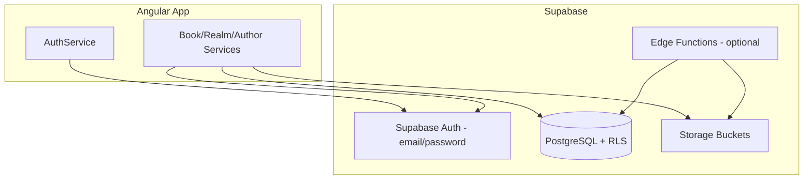
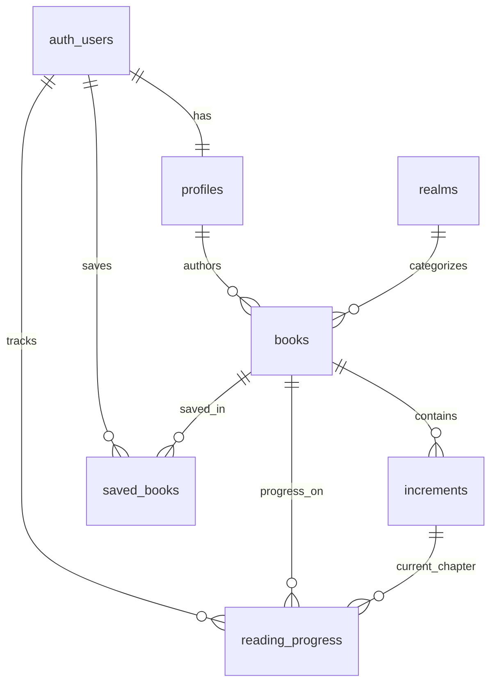

# Supabase Backend Plan (with Authentication)

## Current state

- Backend is **not started**: no `supabase/` folder, no migrations, no `@supabase/supabase-js` in [FictioneersUI/package.json](FictioneersUI/package.json).
- Frontend has realm browsing only via seed data in [FictioneersUI/src/app/core/data/realm.seed.ts](FictioneersUI/src/app/core/data/realm.seed.ts) and a stub [RealmService](FictioneersUI/src/app/core/services/realm.service.ts).
- [TechStack.md](Specifications/TechStack.md) specifies **Supabase** as the MVP backend.

## Architecture overview



**Access pattern:** Angular talks directly to Supabase (PostgREST + Auth + Storage). No separate Express API is required for MVP. Authorization is enforced by **RLS policies**, not client-side checks alone (NFR-5).

**Environment:** Local dev via Supabase CLI (`supabase start`); staging/prod via a linked Supabase Cloud project with the same migrations.

---

## 1. Project setup

Create at repo root:

```
supabase/
  config.toml
  migrations/
  seed.sql
```

**Steps:**
1. Install Supabase CLI; run `supabase init` in repo root.
2. Run `supabase start` for local Postgres, Auth, Storage, Studio.
3. Create a Supabase Cloud project; link with `supabase link --project-ref <ref>`.
4. Add env files (not committed):
   - `FictioneersUI/src/environments/environment.ts` — `supabaseUrl`, `supabaseAnonKey`
   - `FictioneersUI/src/environments/environment.prod.ts` — cloud keys
5. Install `@supabase/supabase-js` in Angular; add a singleton `SupabaseService` in `FictioneersUI/src/app/core/services/`.

**Auth settings (Dashboard / `config.toml`):**
- Enable email/password provider.
- MVP: disable email confirmation for faster dev (enable before prod).
- JWT expiry: default 1 hour (supports FR-R-06 / US-C-01 session-expiry scenarios).
- Password reset via Supabase built-in flow (covers Negative.md "Forgot password" recovery).

---

## 2. Authentication and user profiles

### Supabase Auth (built-in)
- **Sign up:** `supabase.auth.signUp({ email, password })` — US-P-09
- **Sign in:** `supabase.auth.signInWithPassword()` — map all auth errors to generic **"Invalid email or password"** (FR-R-01, security best practice)
- **Sign out:** `supabase.auth.signOut()`
- **Session:** `supabase.auth.onAuthStateChange()` + `getSession()` for nav visibility (US-P-15, FR-A-01)
- **Password reset:** `resetPasswordForEmail()`

### `profiles` table (extends `auth.users`)

| Column | Type | Notes |
|--------|------|-------|
| `id` | uuid PK | FK → `auth.users(id)` ON DELETE CASCADE |
| `display_name` | text | Shown on Authors pages |
| `is_author` | boolean default false | Set true on first book creation OR at signup checkbox |
| `storage_bytes_used` | bigint default 0 | Denormalized quota counter (NFR-7) |
| `created_at` | timestamptz | |

**Dual-role model (your choice):** Every authenticated user is a **reader** (My Books, reading progress). Users with `is_author = true` also see **Books by me**. Nav shows both links when authenticated + `is_author` (US-P-15 adapted).

**Trigger:** `on_auth_user_created` → insert row into `profiles` with `display_name` from signup metadata.

**RLS on `profiles`:**
- SELECT: public can read `id`, `display_name` (for author listings)
- UPDATE: own profile only (`auth.uid() = id`)

---

## 3. Database schema

### Entity relationship



### Tables

#### `realms` (reference data)
Align with existing [realm.model.ts](FictioneersUI/src/app/shared/models/realm.model.ts):

| Column | Type | Notes |
|--------|------|-------|
| `id` | uuid PK | |
| `slug` | text UNIQUE | e.g. `hard-sci-fi` |
| `name` | text | |
| `description` | text nullable | |
| `sort_order` | int | Display order |

Seed from [realm.seed.ts](FictioneersUI/src/app/core/data/realm.seed.ts) in `supabase/seed.sql`.

#### `books`

| Column | Type | Notes |
|--------|------|-------|
| `id` | uuid PK | |
| `author_id` | uuid FK → profiles | |
| `realm_id` | uuid FK → realms | |
| `title` | text NOT NULL | |
| `synopsis` | text NOT NULL | FR-A-03 |
| `cover_path` | text nullable | Storage path |
| `tags` | text[] default '{}' | |
| `status` | enum `draft`, `published` | US-P-11 |
| `search_vector` | tsvector | Full-text search (NFR-10) |
| `updated_at` | timestamptz | Optimistic locking (FR-A-11) |
| `created_at` | timestamptz | |

**Constraints:**
- `UNIQUE (author_id, title)` — Negative.md #12 duplicate title
- Trigger: update `search_vector` from title + synopsis + tags
- Trigger: auto-set `profiles.is_author = true` on first book insert

#### `increments`

| Column | Type | Notes |
|--------|------|-------|
| `id` | uuid PK | |
| `book_id` | uuid FK → books ON DELETE RESTRICT | Prevents orphan deletes |
| `title` | text NOT NULL | |
| `file_path` | text NOT NULL | Storage path |
| `file_format` | enum `epub`, `pdf`, `txt` | FR-A-05 |
| `file_size_bytes` | bigint NOT NULL | Quota tracking |
| `sort_order` | int | Chapter order |
| `created_at` | timestamptz | US-P-14 |

**Constraints:**
- `UNIQUE (book_id, title)` — FR-A-10

#### `saved_books` (My Books)

| Column | Type | Notes |
|--------|------|-------|
| `user_id` | uuid FK → profiles | |
| `book_id` | uuid FK → books | |
| `saved_at` | timestamptz | |

PK: `(user_id, book_id)`

#### `reading_progress`

| Column | Type | Notes |
|--------|------|-------|
| `user_id` | uuid FK → profiles | |
| `book_id` | uuid FK → books | |
| `increment_id` | uuid FK → increments nullable | Current chapter |
| `page_number` | int default 0 | |
| `updated_at` | timestamptz | |

PK: `(user_id, book_id)` — upsert on page turn (US-A-11)

---

## 4. Row Level Security policies

Enable RLS on all tables.

| Table | Anonymous | Authenticated reader | Author (own data) |
|-------|-----------|---------------------|-------------------|
| `realms` | SELECT all | SELECT all | SELECT all |
| `books` | SELECT where `status = 'published'` | SELECT published + own drafts | INSERT/UPDATE/DELETE own rows |
| `increments` | SELECT where parent book published | same | INSERT/UPDATE/DELETE where `book.author_id = auth.uid()` |
| `saved_books` | none | CRUD own rows | CRUD own rows |
| `reading_progress` | none | CRUD own rows | CRUD own rows |
| `profiles` | SELECT public fields | UPDATE own | UPDATE own |

**Book delete rule (FR-A-08):** Enforce via DB function `delete_book_if_empty(book_id)` that raises exception if increments exist — returns message *"Cannot delete book. Please remove all increments first."* Only when increment count = 0 does it delete the book row.

**Optimistic concurrency (FR-A-11):** `update_book()` RPC checks `updated_at` matches client value; if not, raise `BOOK_CONFLICT` for frontend to show conflict message.

---

## 5. Storage buckets

| Bucket | Public read | Max size | Allowed MIME |
|--------|-------------|----------|--------------|
| `book-covers` | yes | 5 MB | `image/jpeg`, `image/png` |
| `book-increments` | yes (published books) | 50 MB | `application/epub+zip`, `application/pdf`, `text/plain` |

**Path convention:**
- Covers: `{author_id}/{book_id}/cover.{ext}`
- Increments: `{author_id}/{book_id}/{increment_id}.{ext}`

**Storage RLS:**
- Upload/update/delete: only when `auth.uid()` matches path prefix and user owns the book
- Read: public for published books; authors can read own drafts

**Quota (NFR-7, 2 GB per author):**
- DB trigger on increment insert/update: sum `file_size_bytes` + cover sizes vs 2 GB cap
- Reject with *"Storage quota exceeded"* before Storage upload completes
- Maintain `profiles.storage_bytes_used` via trigger on increment/cover changes

**Delete integrity (NFR-6):**
- DB trigger or Edge Function on increment/book delete → remove Storage object
- Use `storage.objects` delete via service role in a `SECURITY DEFINER` function

---

## 6. Search (NFR-10)

Add migration `005_search.sql`:
- GIN index on `books.search_vector`
- RPC `search_books(query text, limit int)` using `plainto_tsquery('english', query)`
- Returns published books only; empty result set is valid (FR-R-02 handled in UI)
- Target: sub-500ms at 10k rows with proper indexing

Optional: `pg_trgm` index on `title` for fuzzy matching (post-MVP).

---

## 7. Database functions and triggers (summary)

| Function / Trigger | Purpose |
|--------------------|---------|
| `handle_new_user()` | Create profile on signup |
| `update_book_search_vector()` | Keep FTS index current |
| `check_author_storage_quota()` | Enforce 2 GB limit |
| `delete_book_if_empty()` | FR-A-08 increment-first delete |
| `update_book_with_version()` | FR-A-11 optimistic locking |
| `recalculate_author_storage()` | Sync `storage_bytes_used` |
| `cleanup_storage_on_delete()` | NFR-6 orphan prevention |
| `set_updated_at()` | Auto-touch timestamps |

---

## 8. Edge Functions (minimal, phase 2)

Only where RLS/Storage alone is awkward:

| Function | When needed |
|----------|-------------|
| `delete-increment` | Atomic DB row + Storage object delete |
| `delete-book` | Validates no increments, deletes cover + row |
| `admin-error-notify` | NFR-8 log aggregation (optional webhook) |

Most CRUD can stay client → PostgREST if triggers handle side effects.

---

## 9. Seed and migration strategy

**Migration order:**
1. `001_extensions_and_enums.sql` — `uuid-ossp`, enums
2. `002_core_tables.sql` — profiles, realms, books, increments, saved_books, reading_progress
3. `003_triggers_functions.sql` — all triggers/RPCs
4. `004_rls_policies.sql` — RLS enable + policies
5. `005_storage.sql` — bucket creation + storage policies
6. `006_search.sql` — FTS index + search RPC

**Seed:** `seed.sql` inserts 9 realms from existing frontend seed data.

**Workflow:**
- Local: `supabase db reset` applies migrations + seed
- Cloud: `supabase db push` after `supabase link`

---

## 10. Frontend integration touchpoints (backend contract)

These are the Angular services the backend must support (not full UI work):

| Service | Supabase calls |
|---------|----------------|
| `SupabaseService` | Client init |
| `AuthService` | signUp, signIn, signOut, session, resetPassword |
| `RealmService` | `from('realms').select()` — replace seed |
| `BookService` | CRUD books, realm/author listings |
| `IncrementService` | CRUD increments + Storage upload |
| `LibraryService` | saved_books + reading_progress upsert |
| `SearchService` | RPC `search_books` |

**Route guards:** `authGuard` for `/my-books`, `/books-by-me`, author forms; return URL for FR-C-01.

**Error mapping:** Map Supabase/Postgres error codes to spec messages (invalid credentials, quota exceeded, duplicate title, etc.).

---

## 11. Requirements traceability (key backend responsibilities)

| Requirement | Backend mechanism |
|-------------|-------------------|
| FR-R-01 | Auth error mapping |
| FR-R-02 | Search RPC returns empty set |
| FR-R-03 | Books query by realm returns 0 rows |
| FR-R-04 | Signed Storage URL / missing file → 404 |
| FR-R-05 | saved_books query empty |
| FR-R-06 / US-A-11 | JWT expiry; reading_progress upsert fails → 401 |
| FR-A-01 | RLS + session; nav is frontend |
| FR-A-03–05 | DB constraints + Storage limits + client validation |
| FR-A-08 | `delete_book_if_empty()` |
| FR-A-10 | UNIQUE (book_id, title) |
| FR-A-11 | `updated_at` optimistic lock |
| FR-C-01 | JWT refresh/expiry handling |
| NFR-5 | RLS on all author tables |
| NFR-6 | Cascade Storage cleanup triggers |
| NFR-7 | Quota trigger (2 GB) |
| NFR-10 | FTS + GIN index |

**Note on FR-A-07 vs FR-A-08:** Spec has conflicting delete behavior. Plan follows **FR-A-08** (must remove increments first); confirmation dialog applies only when book has zero increments.

---

## 12. Implementation phases

### Phase 1 — Foundation
- Supabase init (local + cloud link)
- Migrations 001–004: schema, profiles, auth trigger, RLS
- Seed realms
- Angular: SupabaseService, AuthService, login/signup pages, session in nav

### Phase 2 — Public catalog
- Book/increment read paths for published content
- RealmService + BookService wired to Supabase
- Search RPC (migration 006)
- Authors listing from profiles + books

### Phase 3 — Author portal
- Storage buckets + upload flows
- Book/increment CRUD with quota and validation
- Optimistic locking on book edit
- Delete functions with Storage cleanup

### Phase 4 — Reader library
- saved_books CRUD
- reading_progress upsert
- Session-expiry behavior for progress saves

### Phase 5 — Hardening
- Email confirmation for prod
- Error logging (Supabase Logs + optional Edge webhook for NFR-8)
- Load test search and concurrent reads
- `supabase db push` to staging/prod

---

## Key files to create

| Path | Purpose |
|------|---------|
| [supabase/config.toml](supabase/config.toml) | Local Supabase config |
| [supabase/migrations/*.sql](supabase/migrations/) | Schema, RLS, storage, search |
| [supabase/seed.sql](supabase/seed.sql) | Realm seed data |
| [FictioneersUI/src/app/core/services/supabase.service.ts](FictioneersUI/src/app/core/services/supabase.service.ts) | Client wrapper |
| [FictioneersUI/src/app/core/services/auth.service.ts](FictioneersUI/src/app/core/services/auth.service.ts) | Auth layer |
| [FictioneersUI/src/environments/environment.ts](FictioneersUI/src/environments/environment.ts) | Supabase URL + anon key |

---

## Security checklist

- Never expose `service_role` key in Angular
- All author mutations go through RLS-protected tables
- Storage paths scoped by `author_id`
- Generic auth error messages (no email enumeration)
- Anon key only in frontend; service role only in Edge Functions / CI if needed
