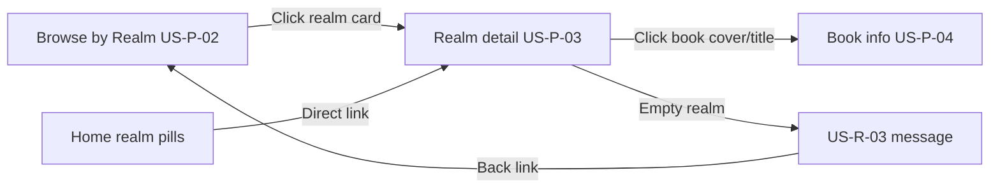

# US‑P‑03: Realm Detail Page — Implementation Plan

## Story

**I, as a reader, want to see a page that displays all books belonging to a selected realm, for focusing my browsing on a specific theme.**

### Acceptance Criteria

```gherkin
Given I click on a realm card
When the realm detail page loads
Then I see the realm name as a heading
And I see a list of book covers and titles from that realm
If the realm has no books, I see a friendly empty state message (covered by US‑R‑03)
```

### Related Requirements

| ID | Requirement |
|----|-------------|
| **US‑P‑02** | Browse by Realm — upstream; realm cards link here |
| **US‑P‑04** | Book info page — downstream; book cards navigate here |
| **US‑R‑03 / FR‑R‑03** | Empty realm: “No books in this realm yet. Check back soon!” + navigation back |
| **FR‑C‑03** | Loading skeleton while page loads |
| **NFR‑1** | First contentful paint within 2 seconds |

---

## Journey Context

### Reader Journey 1 — Stages 2–4



- **Stage 3:** Card click (or home pill) lands on realm detail with book covers + titles.
- **Stage 4:** Book card click navigates to `/books/:id` (stub until US‑P‑04).
- **Recovery:** Time Travel Archives (`bookCount: 0`) shows US‑R‑03 empty state.

---

## Implementation Summary

| Area | Status |
|------|--------|
| `RealmDetailPage` at `/realms/:slug` | ✅ Complete |
| Reactive `paramMap` slug changes | ✅ Complete |
| `BookCardComponent` | ✅ Complete |
| `book.seed.ts` + `BookService` fallback | ✅ Complete |
| US‑R‑03 empty state | ✅ Complete |
| Book loading skeletons | ✅ Complete |
| `books/:id` stub route | ✅ Complete |
| Unit tests (45 total) | ✅ Passing |
| `ng build` | ✅ Succeeds |

### Key files

```
FictioneersUI/src/app/
├── features/realm-detail/          # page + spec
├── features/book-info/             # US-P-04 stub
├── shared/components/book-card/    # reusable card
├── core/data/book.seed.ts          # offline published books
└── core/services/book.service.ts   # getBooksByRealm + getBookById fallbacks
```

---

## How to Verify

```powershell
cd FictioneersUI
npm start
```

| URL | Expected |
|-----|----------|
| `/realms/dragon-realms` | Heading + 2 seed books (when Supabase empty/offline) |
| `/realms/time-travel-archives` | US‑R‑03 empty message + “Browse other realms” |
| `/realms/unknown-slug` | “Realm not found” + back link |
| Click book card | Navigates to `/books/:id` stub |

```powershell
npx ng test --no-watch
npm run build
```

---

## Acceptance Verification Checklist

- [x] Realm name as `h1` heading
- [x] Book covers and titles in `.book-grid`
- [x] US‑R‑03 empty state for zero-book realm
- [x] Recovery link to `/realms`
- [x] Not-found state for unknown slug
- [x] Loading skeletons (realm + books)
- [x] Works unauthenticated
- [x] Reactive reload when slug changes
- [x] No home or browse page content removed

**US‑P‑03 status: Complete.**
