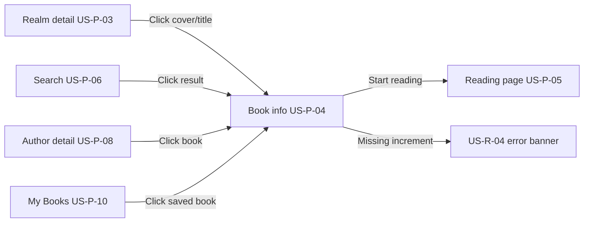
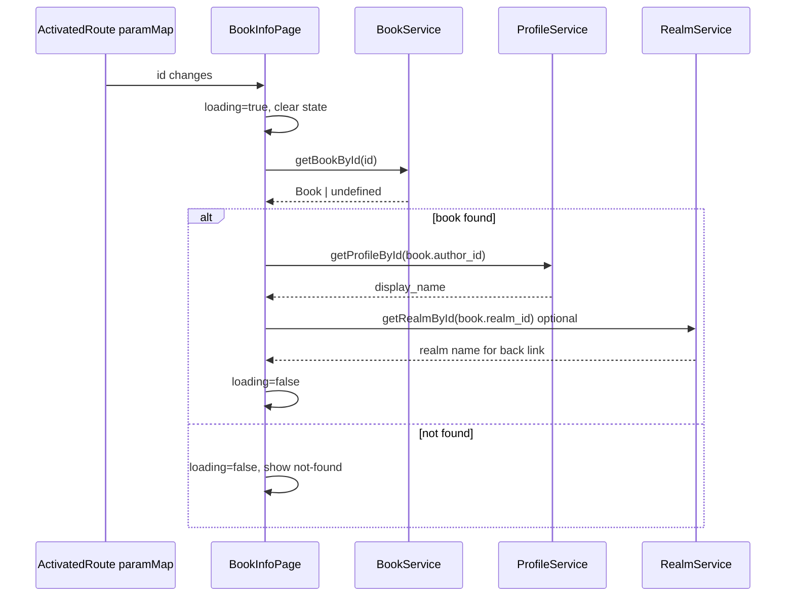

# US‑P‑04: Book Info Page — Implementation Plan

## Story

**I, as a reader, want to see a dedicated page for each book with synopsis, author, and a “Start reading” button, for deciding whether to read the book.**

### Acceptance Criteria

```gherkin
Given I click on a book cover or title from any list
When the book info page loads
Then I see the book cover, title, author name, synopsis, and any tags
And I see a “Start reading” button
And the button is clearly visible and clickable
```

### Related Requirements

| ID | Requirement |
|----|-------------|
| **US‑P‑03** | Realm detail — upstream; `BookCardComponent` links here |
| **US‑P‑05** | Reading page — downstream; “Start reading” destination |
| **US‑P‑06 / US‑P‑08** | Search & author detail — future upstream entry points |
| **US‑R‑04 / FR‑R‑04** | “Start reading” fails when increment missing — error on book info page |
| **Negative #8** | Missing synopsis/author — show `[No description available]` / graceful blank |
| **FR‑C‑03** | Loading skeleton while page loads |
| **NFR‑1** | First contentful paint within 2 seconds |
| **NFR‑9** | Responsive layout (tablet 768px, mobile 375px) |

---

## Journey Context

### Reader Journey 1 — Stages 4–5 (primary path)



| Stage | User goal | Touchpoint expectations |
|-------|-----------|-------------------------|
| **4 — Spotting a book** | Find something appealing | Click cover/title from realm list lands on `/books/:id` |
| **5 — Reading book info** | Decide whether to read | Synopsis, author name, tags visible; prominent “Start reading” |
| **8–9 — Search path** | Pick a search result | Same book info layout regardless of entry route |
| **10–11 — Author path** | Browse by writer | Author name on book info should match author detail heading |
| **14 — My Books** | Resume a saved title | Card click can land here first (reading position handled in US‑P‑05) |

**Emotions to support:** anticipation (stage 4), informed confidence (stage 5). No login required for public published books.

### Author Journey 2 — Stage 5 (indirect)

Authors confirm new books on “Books by me”; post‑MVP “preview as reader view” will reuse this page. For MVP, ensure **published** books from Supabase are readable here without author-only UI (no Edit/Delete on this page).

### Cross-journey constraints

- **Unauthenticated access:** Book info is public for `status = 'published'` (RLS `books_select_published`).
- **Do not remove** existing home page sections, nav items, or realm/browse content (workspace rule).
- Home “Fresh Arrivals” and featured banner still use static markup today; wiring those links to `/books/:id` is **optional follow-up**, not blocking US‑P‑04 (entry via `BookCardComponent` is the MVP path).

---

## Current Codebase

| Area | Status |
|------|--------|
| Route `books/:id` → `BookInfoPage` | ✅ Exists (lazy-loaded in `app.routes.ts`) |
| `BookService.getBookById(id)` | ✅ Exists — Supabase query + `book.seed.ts` fallback |
| `BookCardComponent` → `/books/:id` | ✅ Wired from realm detail |
| `BookInfoPage` UI | ⚠️ **Stub** — title + “coming soon” placeholder only |
| Author name resolution | ❌ Not implemented — `Book` has `author_id` only |
| Tags, cover, synopsis display | ❌ Not implemented on page |
| “Start reading” button | ❌ Not implemented |
| Reading route `books/:id/read` | ❌ Not implemented (US‑P‑05) |
| Reactive `paramMap` on id change | ❌ Uses `snapshot` only — should match realm-detail pattern |
| `book-info.page.spec.ts` | ❌ Missing |
| `ProfileService` / author seed | ❌ Missing |

### Key files (existing)

```
FictioneersUI/src/app/
├── app.routes.ts                           # books/:id route
├── features/book-info/
│   ├── book-info.page.ts                   # stub — load book by id
│   └── book-info.page.html                 # stub — title / not-found only
├── features/realm-detail/                  # reference pattern (paramMap, skeletons)
├── shared/components/book-card/            # upstream navigation
├── core/data/book.seed.ts                # 4 published demo books
├── core/services/book.service.ts           # getBookById, getCoverPublicUrl
└── core/services/increment.service.ts      # getIncrementsByBook (Supabase only)
```

---

## Target UX

### Layout (desktop ≥1024px)

Two-column “detail hero” inside `.section`:

```
┌─────────────────────────────────────────────────────────────┐
│  ← Back to [Realm name]          (contextual back link)     │
├──────────────────┬──────────────────────────────────────────┤
│                  │  [tag] [tag]                             │
│   Book cover     │  Book Title (h1.page-title)              │
│   (2:3 ratio)    │  by Author Name (link when US-P-08 ready) │
│                  │                                          │
│                  │  Synopsis paragraph…                     │
│                  │                                          │
│                  │  [ Start reading ]  (btn btn-primary)    │
└──────────────────┴──────────────────────────────────────────┘
```

### Layout (mobile)

Stack: back link → cover (max-width ~280px, centered) → metadata → CTA full-width.

### Visual tokens (reuse existing)

| Element | Classes / pattern |
|---------|-------------------|
| Cover | `.book-cover`, `.book-cover--placeholder` (from `book-card`) |
| Title | `h1.page-title` |
| Author | `.book-author` (italic muted — already in `styles.scss`) |
| Tags | New `.book-tag` pills (small uppercase, similar to `.realm-card__count`) |
| CTA | `.btn.btn-primary` — same as hero/search |
| Back link | `.realm-detail__back` |
| Loading | Extend `.realm-detail-skeleton` or add `.book-info-skeleton` |
| Read error | `.book-info__error` inline alert (US‑R‑04) |

### Copy

| State | Text |
|-------|------|
| CTA | **Start reading** |
| Empty synopsis | `[No description available]` |
| Unknown author | `Unknown author` |
| Not found | `Book not found` + subtitle + “Browse Realms” button |
| Start reading failure (US‑R‑04) | `Something went wrong. Please try again later.` |

---

## Architecture

### File structure (after implementation)

```
FictioneersUI/src/app/
├── features/book-info/
│   ├── book-info.page.ts
│   ├── book-info.page.html
│   └── book-info.page.spec.ts
├── features/reading/                     # US-P-05 stub (minimal)
│   ├── reading.page.ts
│   └── reading.page.html
├── core/
│   ├── data/
│   │   ├── book.seed.ts                  # unchanged ids
│   │   └── author.seed.ts                # NEW — id → display_name for offline
│   └── services/
│       ├── book.service.ts               # optional: published-only guard
│       └── profile.service.ts            # NEW — getProfileById
└── styles.scss                           # .book-info-detail, .book-tag, skeleton
```

### Route additions

| Path | Component | Story | Notes |
|------|-----------|-------|-------|
| `books/:id` | `BookInfoPage` | **US‑P‑04** | Existing route — replace stub |
| `books/:id/read` | `ReadingPage` | US‑P‑05 stub | Placeholder so CTA has a destination; full reader in US‑P‑05 |

Register `books/:id/read` **before** or as a **child** of `books/:id` so `:id` does not capture `read`. Recommended:

```typescript
{ path: 'books/:id/read', loadComponent: () => import('./features/reading/reading.page').then(m => m.ReadingPage) },
{ path: 'books/:id', loadComponent: () => import('./features/book-info/book-info.page').then(m => m.BookInfoPage) },
```

### Data loading flow



Use `switchMap` + `takeUntilDestroyed` (same as `RealmDetailPage`) so navigating `/books/a` → `/books/b` reloads correctly.

### Author resolution — `ProfileService` (new)

```typescript
@Injectable({ providedIn: 'root' })
export class ProfileService {
  getProfileById(id: string): Observable<Profile | undefined>;

  // Offline: author.seed.ts lookup when !environment.supabaseUrl
  // Online: supabase.from('profiles').select('id, display_name, ...').eq('id', id).maybeSingle()
}
```

**Why separate service:** Author detail (US‑P‑08) and Authors list (US‑P‑07) will reuse it. RLS `profiles_select_public` allows anonymous read of `display_name`.

**Seed authors** (match `book.seed.ts` `author_id` values):

| author_id | display_name |
|-----------|--------------|
| `seed-author-1` | Amara Singh |
| `seed-author-2` | Lena Volkov |
| `seed-author-3` | Julian Reyes |

### Optional realm context for back link

Load realm name via `RealmService` extension:

```typescript
getRealmById(id: string): Observable<Realm | undefined>
```

Back link: `← Dragon Realms` → `/realms/dragon-realms` when realm resolves; fallback `← Browse Realms` → `/realms`.

### Book model usage

All fields already on `Book`:

```typescript
interface Book {
  id: string;
  author_id: string;
  realm_id: string;
  title: string;
  synopsis: string;
  cover_path: string | null;
  tags: string[];
  status: BookStatus;
  // ...
}
```

Cover URL: `BookService.getCoverPublicUrl(book.cover_path)` (same as `BookCardComponent`).

---

## “Start reading” behavior (MVP split with US‑P‑05)

US‑P‑04 owns the **button**; US‑P‑05 owns the **reader**. For this story:

1. Render a visible primary button: **Start reading**.
2. On click, verify the book has at least one increment before navigating:
   - Call `IncrementService.getIncrementsByBook(bookId)` (or a thin `BookService.hasReadableContent(id)` wrapper).
   - **If increments exist:** `router.navigate(['/books', id, 'read'])`.
   - **If none / request fails:** set `readError` signal → show US‑R‑04 message; stay on book info page.
3. **Offline / seed mode:** `IncrementService` currently has no seed fallback. Options (pick one):
   - **A (recommended):** Add `increment.seed.ts` with one TXT increment per seed book; extend `getIncrementsByBook` to return seed data when `!environment.supabaseUrl`.
   - **B:** In offline mode, allow navigation to reading stub without increment check (document as dev-only).
4. US‑P‑05 stub page shows book title + “Reading experience coming soon” so the CTA is not a dead link during parallel development.

US‑R‑04 full implementation spans both stories; book info page must **display the error and not navigate away**.

---

## Component implementation checklist

### `book-info.page.ts`

- [ ] Inject `ActivatedRoute`, `BookService`, `ProfileService`, `RealmService`, `IncrementService`, `Router`.
- [ ] Signals: `book`, `authorName`, `realm`, `loading`, `readError`.
- [ ] `paramMap` pipeline with `switchMap` → `getBookById`.
- [ ] `computed` `coverUrl` from `getCoverPublicUrl`.
- [ ] `startReading()` method with increment check + error handling.
- [ ] `ngOnInit` replaced by route subscription (remove snapshot-only load).

### `book-info.page.html`

- [ ] Loading skeleton (`aria-busy="true"`, `aria-label="Loading book"`).
- [ ] Success state: cover, title, author, synopsis, tags, CTA.
- [ ] `@if (readError())` error banner above CTA.
- [ ] Not-found state (keep existing copy; add recovery link).
- [ ] Conditional synopsis: `currentBook.synopsis || '[No description available]'`.
- [ ] Tags: `@for (tag of currentBook.tags; track tag)` — hide section when empty.
- [ ] Author: `by {{ authorName() || 'Unknown author' }}` — wrap in `routerLink` to `/authors/:authorId` when US‑P‑08 route exists (use plain text until then to avoid 404).

### `styles.scss`

- [ ] `.book-info-detail` — CSS grid `1fr 1.4fr`, gap, `max-[768px]:grid-cols-1`.
- [ ] `.book-info__cover-wrap` — max width, rounded card border consistent with `.book-card`.
- [ ] `.book-tag` — pill chips for tags array.
- [ ] `.book-info-skeleton` — cover + text placeholders.
- [ ] `.book-info__error` — muted card with error text (reuse `.realm-empty` border tokens).

### Services / seed

- [ ] `author.seed.ts` + `getSeedAuthorById`.
- [ ] `profile.service.ts` with Supabase + seed fallback.
- [ ] (Optional) `RealmService.getRealmById`.
- [ ] (Recommended) `increment.seed.ts` + offline branch in `getIncrementsByBook`.

### Routes

- [ ] Add `books/:id/read` reading stub route.

### Tests — `book-info.page.spec.ts`

Mirror `realm-detail.page.spec.ts` patterns:

| Test | Assert |
|------|--------|
| should create | component truthy |
| should show loading skeleton | `.book-info-skeleton` or skeleton `aria-busy` |
| should render title, author, synopsis, tags | text content |
| should render cover placeholder when no cover_path | `.book-cover--placeholder` |
| should render Start reading button | `.btn-primary` text |
| should show not found for unknown id | `Book not found` |
| should reload when id param changes | two ids, two titles |
| should show US-R-04 error when no increments | error message, no navigation |
| should navigate to read when increments exist | `Router.navigate` spy |

### Regression

- [ ] `BookCardComponent` spec still passes (`/books/book-1` href).
- [ ] `RealmDetailPage` spec still passes.
- [ ] `ng build` and `npx ng test --no-watch` succeed.

---

## Entry points (upstream navigation)

| Source | Status | Action for US‑P‑04 |
|--------|--------|---------------------|
| `BookCardComponent` on realm detail | ✅ | No change — already links to `/books/:id` |
| Search results (US‑P‑06) | 🔜 | Use `BookCardComponent` or same `routerLink` when search implemented |
| Author detail (US‑P‑08) | 🔜 | Reuse `BookCardComponent` |
| My Books (US‑P‑10) | 🔜 | Link saved books to `/books/:id` |
| Home featured / arrivals | Static HTML | Optional: link `seed-book-3` for “The Gravity of Lost Things” |

---

## How to Verify

```powershell
cd FictioneersUI
npm start
```

| URL | Expected |
|-----|----------|
| `/realms/dragon-realms` → click book | Lands on `/books/{id}` with full detail |
| `/books/seed-book-1` (offline) | Title, author “Amara Singh”, synopsis, tags `dragons` / `fantasy`, Start reading |
| `/books/unknown-id` | Not found + Browse Realms |
| Click **Start reading** (no increments) | US‑R‑04 error, stays on page |
| Click **Start reading** (with increment) | Navigates to `/books/{id}/read` stub |
| Resize to 375px | Stacked layout, CTA visible without horizontal scroll |

```powershell
npx ng test --no-watch
npm run build
```

---

## Acceptance Verification Checklist

- [ ] Book cover displayed (image or placeholder)
- [ ] Book title as `h1` heading
- [ ] Author name visible (“by …”)
- [ ] Synopsis visible (or `[No description available]`)
- [ ] Tags shown when present
- [ ] “Start reading” button visible, primary styling, clickable
- [ ] Loading skeleton while fetching (FR‑C‑03)
- [ ] Not-found state for invalid id
- [ ] Works unauthenticated for published books
- [ ] Reactive reload when `:id` changes
- [ ] US‑R‑04 error when increment missing (no redirect)
- [ ] No existing pages or elements removed
- [ ] Unit tests added and passing

---

## Implementation Phases

### Phase 1 — Data layer (≈30 min)

1. Add `author.seed.ts` and `ProfileService`.
2. Add `increment.seed.ts` and offline branch in `IncrementService.getIncrementsByBook`.
3. Optional: `RealmService.getRealmById` for contextual back link.

### Phase 2 — Page UI (≈45 min)

1. Rewrite `book-info.page.html` with detail layout.
2. Refactor `book-info.page.ts` to reactive `paramMap` + author/realm loading.
3. Add global styles for `.book-info-detail`, tags, skeleton.

### Phase 3 — Start reading + US‑P‑05 stub (≈30 min)

1. Implement `startReading()` with increment check and US‑R‑04 error.
2. Add minimal `ReadingPage` at `books/:id/read`.
3. Register route in `app.routes.ts`.

### Phase 4 — Tests & polish (≈30 min)

1. `book-info.page.spec.ts` (full checklist above).
2. Manual journey walkthrough: realm → book info → start reading.
3. Confirm NFR‑9 responsive behavior.

**Estimated total:** ~2–2.5 hours.

---

## Out of Scope (defer)

| Item | Story |
|------|-------|
| Paginated reader, page turns | US‑P‑05 |
| Save to My Books button | US‑P‑10 / reader stories |
| Content warnings, ratings, length | Journey 1 improvements |
| “Download for offline” | US‑C‑04 |
| Author bio link styling on author page | US‑P‑08 |
| Preview as reader from author dashboard | Author Journey stage 5 post‑MVP |
| Draft books visible on public book info | Author-only; RLS blocks anon |

---

**US‑P‑04 status: Not started (stub route and service layer partially in place).**
