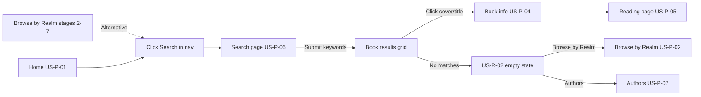

# US‑P‑06: Search Page — Implementation Plan

## Story

**I, as a reader, want to access a search page where I can enter keywords and see matching book results, for finding specific books or topics.**

### Acceptance Criteria

```gherkin
Given I click “Search” in the navigation
When the search page loads
Then I see a text input field and a “Search” button
And I can enter keywords and submit
When results are displayed, they include book covers and titles
```

### Related Requirements

| ID | Requirement |
|----|-------------|
| **US‑P‑04** | Book info page — downstream; result cards navigate here |
| **US‑P‑15** | Navigation — “Search” link for all users (anonymous included) |
| **US‑R‑02 / FR‑R‑02** | No matches → “No books found. Try different keywords.” + Browse by Realm / Authors links |
| **FR‑C‑03** | Loading skeleton while search request is in flight |
| **NFR‑10** | Search returns results (or empty) within **500 ms** for libraries up to 10,000 books |
| **NFR‑1** | Page shell (form + heading) paints quickly — no blocking fetch on initial load |
| **NFR‑9** | Responsive layout — results grid matches realm detail breakpoints |

---

## Journey Context

### Reader Journey 1 — Stages 8–9 (alternative path)



| Stage | User goal | Touchpoint expectations |
|-------|-----------|-------------------------|
| **8 — Using search** | Find a specific book or explore by keyword (e.g., “wizard school”) | Nav “Search” → `/search`; text input + **Search** button; fast, fuzzy-feeling results |
| **9 — Choosing a result** | Pick a relevant book | Click cover/title → `/books/:id` with same book info layout as realm browse path |

**Emotions to support:** efficient, hopeful (stage 8); confident, curious (stage 9). Search is an **alternative** to realm browsing — both paths must feel equally polished.

**Negative scenario #3 (Search found no books):** User enters a keyword with no matches → FR‑R‑02 message (not an error banner) → recovery via Browse by Realm or Authors.

### Author Journey 2 — No direct touchpoint

Authors do not use search in the MVP author portal. Search remains **public and unauthenticated** — no login required, no author-only UI on this page.

### Cross-journey constraints

- **Do not remove** existing nav items, footer links, home sections, or the current search form markup (workspace rule). Extend the stub; keep heading, subtitle, form, and empty-state copy.
- **Published books only:** Supabase RPC `search_books` filters `status = 'published'`; seed fallback must match.
- **Entry parity:** Search results must use the same `BookCardComponent` as realm detail so covers, titles, and `/books/:id` links behave identically (US‑P‑04 upstream).

---

## Current Codebase

| Area | Status |
|------|--------|
| Route `search` → `SearchPage` | ✅ Exists (`app.routes.ts`) |
| Nav link `routerLink="/search"` | ✅ Exists (`app-shell.component.html`) |
| Search form UI (input + button) | ✅ Exists (`search.page.html`) |
| FR‑R‑02 empty state + recovery links | ✅ Exists (shown after submit, but **always** empty today) |
| `SearchService.searchBooks()` | ⚠️ **Partial** — Supabase RPC only; throws when offline / RPC fails |
| Results grid with `BookCardComponent` | ❌ Not implemented |
| Loading skeleton during search | ❌ Not implemented |
| Wire `SearchService` into page | ❌ Stub sets `searched = true` only |
| Offline / seed search fallback | ❌ Not implemented |
| Query param `?q=` (optional) | ❌ Not implemented |
| `search.page.spec.ts` | ⚠️ **Partial** — empty-state test only; no service mock or results tests |
| Global styles `.search-form`, `.search-empty` | ✅ Exists (`styles.scss`) |
| `.book-grid` + `BookCardComponent` | ✅ Exists (reuse from realm detail) |

### Key files (existing)

```
FictioneersUI/src/app/
├── app.routes.ts                           # search route
├── layout/app-shell/app-shell.component.html  # Search nav link
├── features/search/
│   ├── search.page.ts                      # stub — no API call
│   ├── search.page.html                    # form + empty state shell
│   └── search.page.spec.ts                 # empty state only
├── features/realm-detail/                    # reference — book-grid + skeletons
├── shared/components/book-card/              # reuse for results
├── core/
│   ├── data/book.seed.ts                   # 4 published demo books
│   └── services/
│       ├── search.service.ts               # RPC search_books
│       ├── book.service.ts                 # getCoverPublicUrl (used by BookCard)
│       └── supabase.service.ts             # isConfigured flag
└── styles.scss                             # .search-form, .search-empty, .book-grid

supabase/migrations/20250608100500_search.sql  # GIN index + search_books RPC
```

---

## Target UX

### Initial load (before first search)

```
┌─────────────────────────────────────────────────────────────┐
│  Search the Library                                         │
│  Find books by title, author, or keyword.                   │
├─────────────────────────────────────────────────────────────┤
│  [ Enter keywords…                    ]  [ Search ]         │
│                                                             │
│  (no results area — prompt user to search)                  │
└─────────────────────────────────────────────────────────────┘
```

Optional idle hint below the form (not required for acceptance): *“Try dragons, cyberpunk, or mystery.”*

### After submit — loading (FR‑C‑03)

Reuse realm-detail book skeleton pattern inside `.book-grid`:

```
┌─────────────────────────────────────────────────────────────┐
│  [ query in input ]  [ Search ]                             │
│  ┌────┐ ┌────┐ ┌────┐ ┌────┐ ┌────┐ ┌────┐                  │
│  │░░░░│ │░░░░│ │░░░░│ │░░░░│ │░░░░│ │░░░░│  (skeletons)    │
│  └────┘ └────┘ └────┘ └────┘ └────┘ └────┘                  │
└─────────────────────────────────────────────────────────────┘
```

### After submit — results

```
┌─────────────────────────────────────────────────────────────┐
│  [ dragon              ]  [ Search ]                        │
│  2 results for “dragon”                                     │
│  ┌──────────┐  ┌──────────┐                               │
│  │  cover   │  │  cover   │   ← BookCardComponent         │
│  │  title   │  │  title   │                               │
│  └──────────┘  └──────────┘                               │
└─────────────────────────────────────────────────────────────┘
```

### After submit — no results (US‑R‑02 / FR‑R‑02)

Keep existing copy and links (already correct):

| Element | Text / action |
|---------|----------------|
| Message | **No books found. Try different keywords.** |
| Recovery | **Browse by Realm** → `/realms` |
| Recovery | **Authors** → `/authors` |

### After submit — empty or whitespace query

Do **not** call the API. Optionally show inline hint: *“Enter a keyword to search.”* Do not show the “no books found” empty state (that implies a completed search with zero hits).

### Search error (network / RPC failure)

Show a non-blocking inline message (distinct from empty results):

| Element | Text |
|---------|------|
| Message | **Search is temporarily unavailable. Please try again.** |
| Action | **Retry** button re-runs the last query |

Do not use a scary stack trace. Empty results and errors must remain visually distinct.

### Visual tokens (reuse existing)

| Element | Classes / pattern |
|---------|-------------------|
| Page shell | `.section`, `.section-header`, `h1.page-title` |
| Form | `.search-form`, `.search-form__input`, `.btn.btn-primary` |
| Results grid | `.book-grid` + `app-book-card` (same as `realm-detail.page.html`) |
| Loading | `.book-card.book-card--skeleton` × 6 inside `.book-grid` |
| Empty | `.search-empty`, `.search-empty__message`, `.search-empty__links` |
| Result count | New `.search-results__count` — muted subtitle above grid |
| Error | New `.search-error` — same card border tokens as `.search-empty` |

---

## Architecture

### File structure (after implementation)

```
FictioneersUI/src/app/
├── features/search/
│   ├── search.page.ts              # signals + SearchService
│   ├── search.page.html            # form + loading + results + empty + error
│   └── search.page.spec.ts         # expanded tests
├── core/
│   ├── data/book.seed.ts           # add searchSeedBooks(query)
│   └── services/search.service.ts  # Supabase RPC + seed fallback
└── styles.scss                     # .search-results__count, .search-error (minimal)
```

No new routes or components required — reuse `BookCardComponent`.

### Data loading flow

```mermaid
sequenceDiagram
    participant User as User / form submit
    participant Page as SearchPage
    participant Search as SearchService
    participant SB as Supabase RPC
    participant Seed as book.seed.ts

    User->>Page: submit(query)
    Page->>Page: trim query; abort if empty
    Page->>Page: loading=true, searched=true, clear error
    Page->>Search: searchBooks(query)
    alt Supabase configured
        Search->>SB: rpc search_books(p_query, p_limit)
        SB-->>Search: Book[]
    else Offline / not configured
        Search->>Seed: searchSeedBooks(query)
        Seed-->>Search: matching published Book[]
    end
    Search-->>Page: Observable Book[]
    Page->>Page: results=books, loading=false
    alt books.length === 0
        Page->>Page: show FR-R-02 empty state
    else books.length > 0
        Page->>Page: render book-grid
    end
```

### `SearchService` changes

Mirror `BookService` offline pattern using `SupabaseService.isConfigured`:

```typescript
searchBooks(query: string, limit = 50): Observable<Book[]> {
  const trimmed = query.trim();
  if (!trimmed) {
    return of([]);
  }

  if (!this.supabase.isConfigured) {
    return of(searchSeedBooks(trimmed, limit));
  }

  return from(
    this.supabase.requireClient().rpc('search_books', {
      p_query: trimmed,
      p_limit: limit,
    }),
  ).pipe(
    map(({ data, error }) => {
      if (error) throw error;
      return (data ?? []) as Book[];
    }),
    catchError(() => of(searchSeedBooks(trimmed, limit))), // graceful degrade for dev/demo
  );
}
```

**Note:** `catchError` seed fallback is acceptable for MVP demo resilience; log to `console.warn` in dev only. Production should prefer showing `.search-error` — implement in the page `subscribe` `error` handler and only use service-level fallback if product owner prefers silent degrade.

**Recommended page-level error handling:** Service throws; page catches and sets `error` signal → user sees retry. Service `catchError` used **only** when `!isConfigured`.

### Offline seed search — `searchSeedBooks` (new in `book.seed.ts`)

Simple case-insensitive substring match across `title`, `synopsis`, and `tags` for `status === 'published'` books. Good enough for local `ng serve` without Supabase and for unit tests.

```typescript
export function searchSeedBooks(query: string, limit = 50): Book[] {
  const q = query.trim().toLowerCase();
  if (!q) return [];

  return SEED_BOOKS.filter((book) => {
    if (book.status !== 'published') return false;
    const inTitle = book.title.toLowerCase().includes(q);
    const inSynopsis = book.synopsis.toLowerCase().includes(q);
    const inTags = book.tags.some((tag) => tag.toLowerCase().includes(q));
    return inTitle || inSynopsis || inTags;
  }).slice(0, limit);
}
```

**Demo queries (offline):**

| Query | Expected seed hits |
|-------|-------------------|
| `dragon` | Ember of the Last Dragon, Hoard of the Sky Wyrm |
| `cyberpunk` | Neon Sacrament |
| `gravity` | The Gravity of Lost Things |
| `wizard school` | *(none — triggers US‑R‑02 empty state)* |

Supabase FTS (`plainto_tsquery`) may rank/stem differently; offline matching is approximate by design.

### Optional: URL query param `?q=`

Not required for US‑P‑06 acceptance, but low-cost and useful for journey testing:

1. On init, read `ActivatedRoute.queryParamMap` → if `q` present, prefill input and auto-run search.
2. On successful submit, `router.navigate([], { queryParams: { q: trimmed }, queryParamsHandling: 'merge', replaceUrl: true })`.

Defer if time-constrained; document as Phase 2 polish.

---

## Component implementation checklist

### `search.page.ts`

- [ ] Inject `SearchService`; optional `Router` + `ActivatedRoute` for query param sync.
- [ ] Replace class fields with signals: `query`, `results`, `loading`, `searched`, `error`, `lastQuery`.
- [ ] Import `BookCardComponent` in component `imports`.
- [ ] `search(event?: Event)`:
  - `preventDefault` on form submit.
  - Trim query; return early if empty (no `searched` flip).
  - Set `loading=true`, `searched=true`, `error=null`, `lastQuery=trimmed`.
  - Call `searchService.searchBooks(trimmed).pipe(takeUntilDestroyed(...)).subscribe({ next, error })`.
- [ ] `retrySearch()` reuses `lastQuery`.
- [ ] Unsubscribe via `takeUntilDestroyed` or `DestroyRef` (match `RealmDetailPage`).

### `search.page.html`

Keep existing section header and form. Extend results area:

- [ ] `@if (loading())` — skeleton `.book-grid` (6 placeholders), `aria-busy="true"`, `aria-label="Searching books"`.
- [ ] `@else if (searched() && error())` — `.search-error` + Retry button.
- [ ] `@else if (searched() && results().length === 0)` — existing `.search-empty` block (**unchanged copy**).
- [ ] `@else if (searched() && results().length > 0)` — optional count line + `.book-grid` with `@for (book of results(); track book.id) { <app-book-card [book]="book" /> }`.
- [ ] Preserve `role="status"` on empty state.

### `styles.scss`

- [ ] `.search-results__count` — `@apply mb-6 text-sm font-light text-muted;`
- [ ] `.search-error` — mirror `.search-empty` card; message + centered retry button.

### `search.service.ts`

- [ ] Inject `SupabaseService`; branch on `isConfigured`.
- [ ] Import `searchSeedBooks` for offline path.
- [ ] Trim query at service boundary.
- [ ] Return `of([])` for blank query.

### `book.seed.ts`

- [ ] Add `searchSeedBooks(query, limit?)` export.

### Tests — `search.page.spec.ts`

Provide a mock `SearchService` (same pattern as other page specs):

| Test | Assert |
|------|--------|
| should create | component truthy |
| should render search input and button on load | `input`, `.btn-primary` with “Search” |
| should not show empty state before search | no `.search-empty` |
| should show loading skeleton while searching | `.book-card--skeleton` or `aria-busy` |
| should render results with book titles | mock returns 2 books; titles in DOM |
| should show empty state when no results | existing test — update to mock empty `[]` |
| should show error state on service failure | error callback; `.search-error` text |
| should not call service for whitespace query | spy not called |
| should import BookCardComponent | results contain `app-book-card` or book links |

### Regression

- [ ] Existing empty-state test still passes (adjust for `SearchService` mock).
- [ ] `RealmDetailPage` / `BookCardComponent` specs unchanged.
- [ ] `ng build` and `npx ng test --no-watch` succeed.

---

## Downstream navigation (US‑P‑04)

| Source | Route | Notes |
|--------|-------|-------|
| `BookCardComponent` on search results | `/books/:id` | Same as realm detail — no search-specific book info changes |
| FR‑R‑02 recovery | `/realms`, `/authors` | Already wired with `routerLink` |

When US‑P‑04 is complete, manual journey: **Search → click result → book info → Start reading**.

---

## How to Verify

```powershell
cd FictioneersUI
npm start
```

| Step | Expected |
|------|----------|
| Click **Search** in nav | `/search` loads with input + **Search** button |
| Submit empty / spaces only | No API call; no empty-results message |
| Search `dragon` (offline or online) | Grid with ≥1 book; cover placeholder + title visible |
| Search `wizard school` | FR‑R‑02 message + Browse by Realm + Authors links |
| Click a result card | Navigates to `/books/{id}` |
| Throttle network (DevTools) | Skeleton visible during fetch (FR‑C‑03) |
| Resize to 375px | `.book-grid` 2 columns; form wraps without horizontal scroll |

```powershell
npx ng test --no-watch
npm run build
```

---

## Acceptance Verification Checklist

- [ ] Text input field visible with accessible label
- [ ] “Search” button visible and submits the form
- [ ] Keywords can be entered and submitted
- [ ] Results show book **covers** (image or placeholder) and **titles**
- [ ] Results clickable → book info page (`/books/:id`)
- [ ] US‑R‑02 empty state with correct copy and recovery links
- [ ] Loading skeleton during search (FR‑C‑03)
- [ ] Works unauthenticated (no login gate on `/search`)
- [ ] Nav “Search” link reaches this page (US‑P‑15 partial)
- [ ] No existing pages or nav elements removed
- [ ] Unit tests added/updated and passing
- [ ] Offline demo works via `searchSeedBooks` when Supabase unavailable

---

## Implementation Phases

### Phase 1 — Data layer (≈20 min)

1. Add `searchSeedBooks` to `book.seed.ts`.
2. Extend `SearchService` with `isConfigured` branch and trim handling.

### Phase 2 — Page logic + template (≈35 min)

1. Refactor `search.page.ts` to signals + `SearchService` subscription.
2. Update `search.page.html` with loading, results grid, error state.
3. Import `BookCardComponent`.

### Phase 3 — Styles + polish (≈15 min)

1. Add `.search-results__count` and `.search-error` to `styles.scss`.
2. (Optional) Query param `?q=` sync.

### Phase 4 — Tests & manual journey (≈30 min)

1. Expand `search.page.spec.ts` with `SearchService` mock.
2. Walk Reader Journey 1 stages 8–9: search → result → book info.
3. Confirm Negative #3 recovery path.

**Estimated total:** ~1.5–2 hours.

---

## Out of Scope (defer)

| Item | Story / note |
|------|----------------|
| Filter by author or realm | Journey 1 stage 8 post-MVP improvement |
| Highlight matching keyword in snippet | Journey 1 stage 9 post-MVP improvement |
| Search authors by name | US‑P‑07 / US‑P‑08 scope |
| Typeahead / search-as-you-type | Post-MVP |
| Pagination of large result sets | RPC `p_limit=50` sufficient for MVP |
| Save search to My Books from results | US‑P‑10 |
| Login required for search | Explicitly public |

---

**US‑P‑06 status: Not started (route, form shell, empty state, and `SearchService` RPC stub exist; results wiring and offline fallback pending).**
