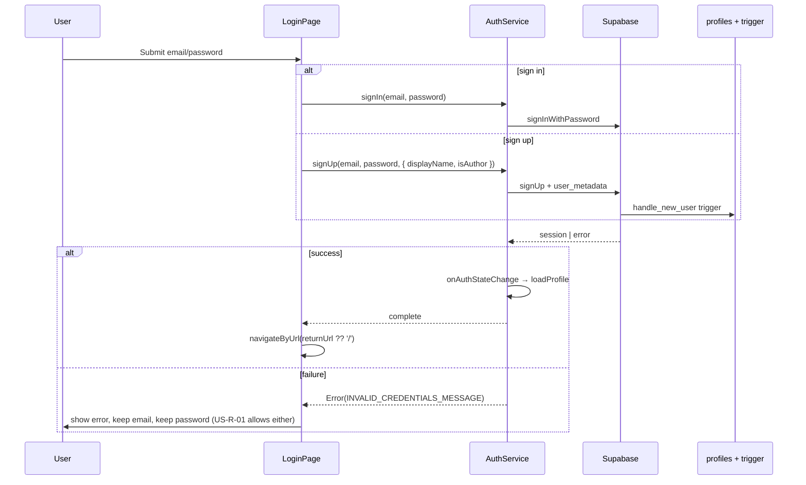

# US‑P‑09: Login Page / Modal — Implementation Plan

## Story

**I, as a reader or author, want to access a login form with email and password fields, for authenticating myself to access personal sections.**

### Acceptance Criteria

```gherkin
Given I click “Log in” in the navigation
When the login form appears (as a page or modal)
Then I see fields for email and password
And I see a “Submit” or “Log in” button
And I see a link to sign up (if new user)
```

### Related Requirements

| ID | Requirement |
|----|-------------|
| **US‑P‑15** | Navigation — “Log in” when anonymous; “My Books” / “Books by me” + “Log out” when authenticated |
| **US‑P‑10** | My Books — downstream; requires successful login |
| **US‑P‑11** | Books by me — downstream; requires author login |
| **US‑R‑01 / FR‑R‑01** | Wrong credentials → “Invalid email or password”; user stays logged out |
| **US‑A‑01 / FR‑A‑01** | “Books by me” nav visible only after auth; author role from `profiles.is_author` |
| **US‑C‑01 / FR‑C‑01** | Guard redirect to login with `returnUrl`; resume destination after success |
| **NFR‑5** | Unauthenticated users blocked from protected routes (`authGuard`, `authorGuard`) |
| **NFR‑1** | Page loads quickly — form is static; no heavy data fetch |

---

## Journey Context

### Reader Journey 1 — Stage 12 (optional authenticated path)

```mermaid
flowchart LR
    Browse[Browse / read public books] -->|Optional| NavLogin[Click Log in US-P-09]
    NavLogin --> LoginPage[/login page]
    LoginPage -->|Success| MyBooks[My Books US-P-10]
    MyBooks --> Reading[Reading page US-P-05]
    LoginPage -->|Sign up toggle| SignUp[Create account same page]
    SignUp -->|Success| MyBooks
```

| Stage | User goal | Touchpoint expectations |
|-------|-----------|-------------------------|
| **12 — Signing up / logging in** | Access “My Books” to save favorites | Quick, optional auth; email + password; sign-up path for new users |
| **13 — My Books** | See saved library | Nav shows “My Books” only after login (US‑P‑15) |

**Emotions to support:** willing, neutral — auth must not block the main reading journey (stages 1–7 remain login-free).

### Author Journey 2 — Stage 1 (required entry)

```mermaid
flowchart LR
    NavLogin[Click Log in] --> LoginPage[/login page]
    LoginPage -->|Reader account| Home[Home — no Books by me]
    LoginPage -->|Author signup or author profile| BooksByMe[Books by me US-P-11]
    GuardBlock[/books-by-me without auth/] -->|authGuard redirect| LoginPage
    LoginPage -->|returnUrl=/books-by-me| BooksByMe
    BooksByMe --> Logout[Log out US-P-15]
    Logout --> Home
```

| Stage | User goal | Touchpoint expectations |
|-------|-----------|-------------------------|
| **1 — Logging in** | Reach author-only features | Credentials submit fast; clear errors on failure |
| **2 — Books by me** | Manage publications | Nav “Books by me” appears only when `is_author === true` |

**Emotions to support:** anticipatory, focused — author expects immediate access after valid login.

### Cross-journey constraints

- **Page vs modal:** Story allows either. **Use a dedicated page at `/login`** (already routed) — works with `returnUrl` from guards, deep links, and browser back. Modal overlay is post-MVP.
- **Reading stays public:** Login is never required for published book info or reading (US‑P‑05).
- **Do not remove** existing nav items, footer links, or page sections (workspace rule). Extra nav links (Library, Collections, Community) stay as-is until US‑P‑15 cleanup.
- **Logout** lives in nav (`AppShellComponent`), not on the login page — Author Journey stage 15.

---

## Current Codebase

| Area | Status |
|------|--------|
| Route `/login` → `LoginPage` | ✅ Exists (`app.routes.ts`) |
| Nav “Log in” link | ✅ `app-shell.component.html` |
| Email + password fields | ✅ `login.page.html` |
| “Log in” submit button | ✅ Label toggles to “Sign up” in signup mode |
| Sign-up link (“New here? Sign up”) | ✅ Toggle on same page |
| `AuthService.signIn` / `signUp` | ✅ Supabase `signInWithPassword` / `signUp` |
| Profile creation on signup | ✅ DB trigger `handle_new_user` reads `display_name`, `is_author` metadata |
| `returnUrl` redirect after login | ✅ `login.page.ts` reads query param |
| Guard redirect to `/login?returnUrl=…` | ✅ `auth.guard.ts`, `author.guard.ts` |
| US‑R‑01 error message | ✅ `INVALID_CREDENTIALS_MESSAGE` |
| Author signup checkbox | ✅ Extra field for Journey 2 — not required by US‑P‑09 but keep |
| Chronicles design system styling | ⚠️ **Gap** — page uses generic Tailwind (`indigo-600`), not `.section` / `.btn-primary` |
| `login.page.spec.ts` | ❌ Missing |
| Redirect if already authenticated | ❌ Missing — logged-in user can open `/login` |
| Supabase-not-configured UX | ❌ Missing — `environment.supabaseUrl` is empty in dev; submit throws |
| `environment.ts` typo | ⚠️ `asupabaseUrl` holds URL; `supabaseUrl: ''` disables auth |
| Auth session loading vs guards | ⚠️ `authGuard` returns `true` while `auth.loading()` — brief flash possible |
| Password reset link | ❌ Not in UI (`AuthService.resetPassword` exists) |
| Social login | ❌ Out of scope (journey improvement) |

### Key files (existing)

```
FictioneersUI/src/app/
├── app.routes.ts                           # /login route (no guard)
├── features/login/
│   ├── login.page.ts                       # submit, toggle signup, returnUrl
│   └── login.page.html                     # form — needs design-system pass
├── core/services/auth.service.ts           # session signals, signIn/signUp/signOut
├── core/services/supabase.service.ts       # isConfigured gate
├── core/guards/auth.guard.ts               # redirect + returnUrl
└── layout/app-shell/
    ├── app-shell.component.html            # Log in / Log out / role-based links
    └── app-shell.component.ts              # logout()

supabase/migrations/
└── 20250608100200_triggers_functions.sql   # handle_new_user trigger
```

---

## Design Decision: Page (not modal)

| Option | Pros | Cons | MVP choice |
|--------|------|------|------------|
| **Dedicated `/login` page** | Guard redirects work; bookmarkable; matches existing code; accessible focus management | Leaves current browsing context | **Yes** |
| **Modal overlay** | Stays on current page | Harder `returnUrl`; focus trap; duplicate entry points | Defer post-MVP |

Sign-up stays on the **same page** via mode toggle (already implemented) — satisfies “link to sign up” without a separate route.

---

## Target UX

### Layout

Centered auth card inside standard page section (match Search page structure):

```
┌─────────────────────────────────────────────────────────────┐
│  section (max-width 1400px)                                 │
│    ┌─────────────────────────────────────┐                  │
│    │  auth-card (max-width ~420px, centered)                 │
│    │  h1.page-title — Log in / Create account               │
│    │  p.section-subtitle — optional one-liner                 │
│    │  [Display name]     (signup only)                        │
│    │  [☐ Author checkbox] (signup only)                       │
│    │  Email input                                             │
│    │  Password input                                          │
│    │  [error alert]      role="alert"                         │
│    │  [ Log in ]         btn btn-primary, full width          │
│    │  New here? Sign up  text link / button                   │
│    └─────────────────────────────────────┘                  │
└─────────────────────────────────────────────────────────────┘
```

### Visual tokens (reuse existing)

| Element | Classes / pattern |
|---------|-------------------|
| Section wrapper | `.section` |
| Title | `h1.page-title` — “Log <span>in</span>” / “Create <span>account</span>” |
| Subtitle | `.section-subtitle` — e.g. “Access your saved books and author tools.” |
| Card | `.auth-card` — bordered card like `.realm-empty` / search empty states |
| Inputs | `.auth-form__input` — mirror `.search-form__input` (dark bg, border, focus ring) |
| Labels | `.auth-form__label` |
| Primary CTA | `.btn.btn-primary` — full width |
| Mode toggle | `.auth-form__toggle` — underline text button, primary color on hover |
| Error | `.auth-form__error` — `role="alert"`, muted red border |
| Disabled submit | `[disabled]="loading()"` + reduced opacity |
| Checkbox row | `.auth-form__checkbox` |

### Copy

| State | Text |
|-------|------|
| Login heading | **Log in** |
| Signup heading | **Create account** |
| Email label | **Email** |
| Password label | **Password** |
| Submit (login) | **Log in** |
| Submit (signup) | **Sign up** |
| Loading | **Please wait…** |
| Sign-up prompt | **New here?** → **Sign up** |
| Login prompt | **Already have an account?** → **Log in** |
| Author checkbox | **I want to publish books as an author** |
| Invalid credentials (US‑R‑01) | **Invalid email or password** |
| Supabase offline | **Sign-in is unavailable. Configure Supabase to enable login.** |
| Already logged in | Redirect silently to `returnUrl` or `/` |

---

## Architecture

### Auth flow



### Post-login navigation

| User type | `returnUrl` | Default if missing |
|-----------|-------------|-------------------|
| Reader | e.g. `/my-books` | `/` (home) |
| Author | e.g. `/books-by-me` | `/` — author uses nav to reach dashboard |
| Non-author hitting `authorGuard` | Redirected to `/` after login if not author | — |

`authorGuard` already sends non-authors to `/` after login when `returnUrl` was `/books-by-me`.

### Sign-up metadata → profile

`AuthService.signUp` passes Supabase `options.data`:

```typescript
{
  display_name: options.displayName ?? email.split('@')[0],
  is_author: options.isAuthor ?? false,
}
```

DB trigger `handle_new_user` inserts into `public.profiles` — no client-side profile insert needed.

---

## Component Implementation Checklist

### `login.page.ts`

- [ ] Inject `SupabaseService` (or expose `auth.isConfigured` on `AuthService`) for offline banner.
- [ ] On init: if `auth.isAuthenticated()`, redirect to `returnUrl ?? '/'` (skip form for logged-in users).
- [ ] Optional: read `?mode=signup` query param to open in signup mode (author onboarding link).
- [ ] Guard submit when `!supabase.isConfigured` — set error message, do not call API.
- [ ] Keep `returnUrl` from `ActivatedRoute.snapshot` (or `queryParamMap` subscription if slug changes matter).
- [ ] After successful login, wait for profile load if nav depends on `isAuthor` (see note below).
- [ ] Preserve email on error; keep password filled (US‑R‑01 allows “remains for retry”).

**Profile load timing:** `onAuthStateChange` loads profile asynchronously. If author lands on `/books-by-me` immediately, `authorGuard` may run before profile loads. **Mitigation:** in `signIn`/`signUp` success handler, await `auth.loadProfile()` (expose package-private method or return profile from sign-in observable) before navigating when `returnUrl` is author-only.

### `login.page.html`

- [ ] Wrap in `<section class="section">` + `.auth-card`.
- [ ] Use design-system classes (remove inline `indigo-600`, `max-w-md` ad-hoc Tailwind where globals exist).
- [ ] `autocomplete="email"`, `autocomplete="current-password"` / `new-password`.
- [ ] `@if (!isConfigured)` config warning above form.
- [ ] Error block with `role="alert"`.
- [ ] Submit button: `.btn.btn-primary`, `[disabled]="loading() || !isConfigured"`.
- [ ] Sign-up toggle link at bottom (keep existing behavior).

### `styles.scss`

- [ ] `.auth-card` — centered, max-width ~420px, padding, border consistent with app cards.
- [ ] `.auth-form` — flex column, gap.
- [ ] `.auth-form__input` — match `.search-form__input`.
- [ ] `.auth-form__error` — visible error state.
- [ ] `.auth-form__toggle` — text button for mode switch.
- [ ] `.nav-link-btn` — if missing, style logout button like nav links (may already inherit).

### `auth.service.ts` (minimal tweaks)

- [ ] Add readonly `isConfigured` computed from `SupabaseService`.
- [ ] Optionally expose `waitForProfile(): Promise<void>` after sign-in for guard-safe navigation.
- [ ] Keep generic `INVALID_CREDENTIALS_MESSAGE` for all sign-in failures (US‑R‑01).

### `auth.guard.ts` (optional hardening — separate small task)

- [ ] Replace `if (auth.loading()) return true` with wait-for-session resolver or functional guard that returns `Observable`/`Promise` until `loading()` is false — prevents flash of protected content. Can ship with US‑P‑09 or US‑P‑15.

### Environment

- [ ] Fix `environment.ts`: set `supabaseUrl` to project URL (remove stray `asupabaseUrl` typo) so local login works against Supabase Cloud.
- [ ] Document that anon browsing works with empty URL; auth requires configured Supabase.

### Tests — `login.page.spec.ts`

Mirror patterns from `search.page.spec.ts` / `book-info.page.spec.ts`:

| Test | Assert |
|------|--------|
| should create | component truthy |
| should render email and password fields | `input[type=email]`, `input[type=password]` |
| should render Log in button | `.btn-primary` text “Log in” |
| should show Sign up toggle when logged out | “Sign up” button visible |
| should toggle to signup mode | heading “Create account”, author checkbox visible |
| should display error on failed signIn | `INVALID_CREDENTIALS_MESSAGE`, `role="alert"` |
| should call signIn and navigate on success | AuthService spy, Router.navigateByUrl |
| should use returnUrl query param | navigate to `/my-books` when `?returnUrl=/my-books` |
| should redirect when already authenticated | Router.navigate when session present |
| should disable submit when Supabase not configured | button disabled + message |

Mock `AuthService`, `SupabaseService`, `Router`, `ActivatedRoute`.

### Regression

- [ ] `app-shell` still shows “Log in” when logged out.
- [ ] Protected routes still redirect to `/login?returnUrl=…`.
- [ ] No pages or nav elements removed.
- [ ] `ng build` and `npx ng test --no-watch` succeed.

---

## Entry Points

| Source | Route / action | Notes |
|--------|----------------|-------|
| Nav “Log in” | `/login` | Primary US‑P‑09 path |
| `authGuard` on `/my-books` | `/login?returnUrl=/my-books` | Reader Journey stage 12 → 13 |
| `authorGuard` on `/books-by-me` | `/login?returnUrl=/books-by-me` | Author Journey stage 1 → 2 |
| Sign-up toggle | Same page, no route change | Satisfies “link to sign up” |
| Future FR‑C‑01 session expiry | Form submit → redirect login | Reuse `returnUrl` pattern |

---

## How to Verify

```powershell
cd FictioneersUI
# Ensure environment.supabaseUrl is set for auth testing
npm start
```

| Step | Expected |
|------|----------|
| Click **Log in** in nav | Lands on `/login` with email, password, **Log in** button |
| Click **Sign up** | Form switches to signup; author checkbox appears |
| Submit wrong password | **Invalid email or password**; still logged out |
| Submit valid reader credentials | Redirect to `/` or `returnUrl`; nav shows **My Books**, **Log out** |
| Sign up with author checkbox | After login, nav shows **Books by me** |
| Visit `/my-books` logged out | Redirect to `/login?returnUrl=/my-books`; after login → My Books |
| Visit `/books-by-me` logged out | Redirect with returnUrl; author sees dashboard |
| Visit `/login` while logged in | Redirect to home (after implementation) |
| Log out (nav) | Session cleared; **Log in** returns; Author Journey stage 15 |

```powershell
npx ng test --no-watch
npm run build
```

---

## Acceptance Verification Checklist

- [ ] “Log in” nav opens login form (page at `/login`)
- [ ] Email field visible and required
- [ ] Password field visible and required
- [ ] “Log in” (or Submit) button visible and clickable
- [ ] Link/toggle to sign up for new users
- [ ] US‑R‑01: invalid credentials show **Invalid email or password**
- [ ] Successful login updates nav per US‑P‑15 (My Books / Books by me / Log out)
- [ ] `returnUrl` honored after login (FR‑C‑01 partial)
- [ ] Styled consistently with Chronicles design system
- [ ] Works when Supabase configured; graceful message when not
- [ ] No existing pages or elements removed
- [ ] Unit tests added and passing

---

## Implementation Phases

### Phase 1 — Environment & service readiness (≈15 min)

1. Fix `environment.ts` `supabaseUrl` (remove typo key).
2. Add `AuthService.isConfigured` (or use `SupabaseService` in page).
3. Optional: `waitForProfile()` after sign-in for author `returnUrl`.

### Phase 2 — UI & design system (≈45 min)

1. Restyle `login.page.html` with `.section`, `.auth-card`, `.btn-primary`.
2. Add `.auth-form__*` styles to `styles.scss`.
3. Redirect authenticated users away from `/login`.
4. Supabase-not-configured banner.

### Phase 3 — Tests & guard polish (≈45 min)

1. Create `login.page.spec.ts` (full checklist above).
2. Optional: improve `authGuard` session wait (coordinate with US‑P‑15).
3. Manual walkthrough: Reader Journey stage 12; Author Journey stages 1, 2, 15.

### Phase 4 — Documentation & handoff (≈10 min)

1. Update this file’s **Implementation Summary** table when complete.
2. Note any follow-ups for US‑P‑10 / US‑P‑11 empty states.

**Estimated total:** ~2 hours (core already ~60% done).

---

## Out of Scope (defer)

| Item | Story / note |
|------|----------------|
| Login modal overlay | Post-MVP; page satisfies US‑P‑09 |
| Social login (Google, etc.) | Journey 1 improvement |
| “Remember me” | Author Journey improvement |
| Password reset UI | `resetPassword` exists; add link post-MVP |
| Email confirmation flow | Supabase project setting — document if confirm email enabled |
| My Books / Books by me page content | US‑P‑10, US‑P‑11 |
| Full nav cleanup (Library, Collections placeholders) | US‑P‑15 |
| Session-expired banner on reading page | US‑R‑06 |
| Form data preservation after re-login | US‑C‑01 full |

---

## Implementation Summary

| Area | Status |
|------|--------|
| `/login` route + form fields | ✅ Complete |
| Sign-up toggle + author checkbox | ✅ Complete |
| `AuthService` + Supabase auth | ✅ Complete |
| Nav “Log in” + guards + `returnUrl` | ✅ Complete |
| US‑R‑01 error message | ✅ Complete |
| Chronicles design system styling | ❌ Not started |
| Authenticated-user redirect | ❌ Not started |
| Supabase-not-configured UX | ❌ Not started |
| `environment.ts` URL fix | ❌ Not started |
| Profile await before author redirect | ❌ Not started |
| `login.page.spec.ts` | ❌ Not started |

**US‑P‑09 status: Partially implemented — polish, env fix, tests, and design-system alignment remaining.**
