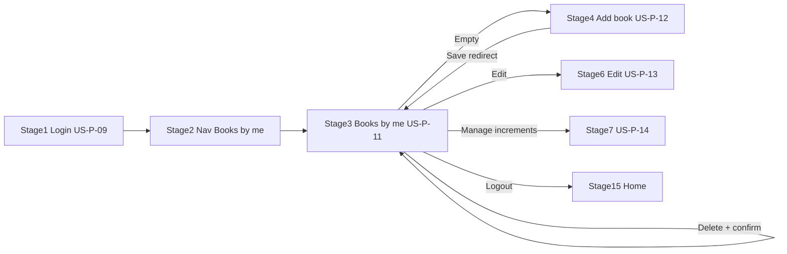

# US‑P‑11: Books by Me Page — Implementation Plan

## Story

**I, as an author, want to access a "Books by me" page that lists all the books I have authored, for managing my publications.**

### Acceptance Criteria

```gherkin
Given I am authenticated as an author
When I click "Books by me" in the navigation
Then I see a grid or list of book cards
Each card shows cover (placeholder if none), title, status (draft/published), and "Edit" / "Delete" buttons
If I have no books, I see an empty state with an "Add new book" button (covered by US-A-02)
And this page is not visible to unauthenticated users
```

### Related Requirements

| ID | Requirement | Role in US-P-11 |
|----|-------------|-----------------|
| **US-P-15** | Nav adapts to auth/role | "Books by me" only when `isAuthor()` |
| **US-A-01 / FR-A-01** | Section visible only after login | `authorGuard` + nav conditional |
| **US-A-02 / FR-A-02** | Empty state + "Add new book" CTA | Empty-state work |
| **US-A-06 / FR-A-07** | Delete confirmation dialog | Implement on this page |
| **US-A-07 / FR-A-08** | Block delete when increments exist | `BookService.deleteBookIfEmpty()` + error banner |
| **US-P-12** | Add new book form | Downstream — wire CTA route only |
| **US-P-13** | Edit book form | Downstream — wire Edit route only |
| **US-P-14** | Manage increments | Downstream — wire button from Author Journey stage 7 |
| **FR-C-03** | Loading skeleton | Match realm-detail pattern |
| **FR-C-04** | Destructive action confirmation | Delete dialog |
| **NFR-5** | Unauthenticated blocked | `authorGuard` → `/login?returnUrl=...` |
| **NFR-9** | Responsive layout | Reuse `.book-grid` breakpoints |

---

## Journey Context

### Author Journey 2 — Stages 1–3, 5, 13–14



| Stage | User goal | US-P-11 touchpoints |
|-------|-----------|---------------------|
| **1 — Login** | Access author features | `returnUrl=/books-by-me` lands on dashboard |
| **2 — Nav** | Reach dashboard | Nav link visible only when authenticated + `is_author` |
| **3 — View books** | See all authored books at a glance | Grid of cards: cover, title, status, actions |
| **5 — Confirm new book** | Verify book appears after add | List refreshes when returning from US-P-12 (future) |
| **13–14 — Delete book** | Remove unwanted book | Delete button → confirmation → card removed |

**Context note:** "Books by me" is only available to authenticated authors. Unauthenticated users must not see the nav item or reach the route.

### Reader Journey 1

No direct touchpoint — confirms US-P-11 is author-only and must not appear in anonymous or reader-only nav states.

### Negative scenarios

| # | Scenario | US-P-11 response |
|---|----------|------------------|
| **10** | New author, zero books | FR-A-02 empty state |
| **20–21** | Accidental / blocked book delete | FR-A-07 confirmation; FR-A-08 error message via `mapBookError()` |
| **22** | Failed to load dashboard | "Failed to load your books. Please refresh." + retry |

---

## Implementation Summary

| Area | Status |
|------|--------|
| Route `/books-by-me` + `authorGuard` | ✅ Complete |
| Nav "Books by me" when `isAuthor()` | ✅ Complete |
| `AuthorBookCardComponent` | ✅ Complete |
| Design-system page layout + skeletons | ✅ Complete |
| FR-A-02 empty state | ✅ Complete |
| FR-A-07 delete confirmation | ✅ Complete |
| FR-A-08 delete blocked error | ✅ Complete |
| Stub routes for US-P-12/13/14 | ✅ Complete |
| Unit tests | ✅ Complete |

### Key files

```
FictioneersUI/src/app/
├── features/books-by-me/              # page + spec
├── shared/components/author-book-card/  # author dashboard card
├── features/book-new/                 # US-P-12 stub
├── features/book-edit/                # US-P-13 stub
├── features/book-increments/          # US-P-14 stub
├── core/services/book.service.ts      # getMyBooks, deleteBookIfEmpty
└── styles.scss                        # author-empty, author-book-card
```

---

## How to Verify

```powershell
cd FictioneersUI
npm start
```

| Scenario | Expected |
|----------|----------|
| Visit `/books-by-me` logged out | Redirect to `/login?returnUrl=/books-by-me` |
| Login as reader | Nav has no "Books by me"; direct URL → `/` |
| Login as author, 0 books | Empty state + "Add new book" → stub route |
| Author with books | Grid with cover/placeholder, status, Edit/Delete |
| Delete book with 0 increments | Confirm → card gone |
| Delete book with increments | Error message; book remains |

```powershell
npx ng test --no-watch
npm run build
```

---

## Acceptance Verification Checklist

- [x] `h1.page-title` "Books by me"
- [x] Book grid with cover (or placeholder), title, status on each card
- [x] Edit and Delete buttons on each card
- [x] Manage increments button (journey alignment; links to stub)
- [x] FR-A-02 empty state with clickable "Add new book"
- [x] FR-A-07 delete confirmation dialog
- [x] FR-A-08 error when increments remain
- [x] Loading skeletons (FR-C-03)
- [x] Not visible in nav when logged out (US-P-15 / US-A-01)
- [x] `authorGuard` blocks unauthenticated access (NFR-5)
- [x] Unit tests passing
- [x] No existing pages or nav elements removed

**US-P-11 status: Complete.**

**Dependencies:** US-P-09 (login/guards). **Unblocks:** US-P-12 (Add book), US-P-13 (Edit), US-P-14 (Increments).
