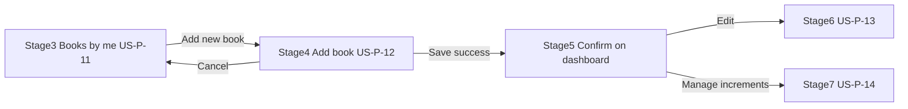

# US‑P‑12: Add New Book Form — Implementation Plan

## Story

**I, as an author, want to see a form with fields for title, synopsis, realm, cover image, and tags, for creating a new book entry.**

### Acceptance Criteria

```gherkin
Given I am on the "Books by me" page
When I click "Add new book"
Then I see a form with the following fields: Title (required), Synopsis (required), Realm (dropdown), Cover image upload, Tags (text input)
And I see a "Save" button and a "Cancel" button
```

### Related Requirements

| ID | Requirement | Role in US-P-12 |
|----|-------------|-----------------|
| **US-P-11** | Books by me dashboard | Entry via header CTA + empty-state CTA (`routerLink="/books/new"`) — already wired |
| **US-P-13** | Edit book form | Share form field markup/styles; do not extract shared component unless duplication becomes painful |
| **US-A-02 / FR-A-02** | Empty state CTA | Lands on this form |
| **US-A-03 / FR-A-03** | Required title + synopsis | Client validation before API call |
| **FR-A-04** | Cover JPG/PNG, max 5 MB | Client validation on file select; server quota via DB triggers |
| **FR-A-09** | Save failure keeps form data | On API error, stay on page with banner; form values retained |
| **Negative #12** | Duplicate title | `BookService.mapBookError()` → "You already have a book with this title…" |
| **Negative #13** | Cover upload fails | Show FR-A-04 message; book may already exist — see save flow below |
| **FR-C-01** | Session expiry | MVP: redirect to `/login?returnUrl=/books/new`; form data not preserved |
| **NFR-5** | Author-only route | `authorGuard` already on route |
| **NFR-2** | Cover upload ≤5 s | Disable Save + show "Saving…" during create + upload |
| **NFR-7** | Storage quota | `mapBookError` handles "Storage quota exceeded" |

**Out of scope (post-MVP):** US-A-13 autosave draft, FR-A-11 concurrent edit (edit only), preview-as-reader.

---

## Journey Context

### Author Journey 2 — Stages 4–5



| Stage | User goal | US-P-12 expectations |
|-------|-----------|------------------------|
| **4 — Adding a book** | Create a new library entry | Simple, fast form; fields match journey: title, synopsis, realm, cover, tags; Save / Cancel |
| **5 — Viewing newly added book** | Confirm book appears | After Save → navigate to `/books-by-me`; new draft card at top (`order by created_at desc` in `getMyBooks`) |

**Emotions:** productive, creative (stage 4); proud, relieved (stage 5).

### Reader Journey 1

No direct touchpoint. New books start as **draft** (`status: 'draft'` in `createBook`) — not visible on public browse/search until published (US-P-13 scope).

### Negative scenarios

| # | Scenario | Response |
|---|----------|----------|
| **11** | Missing title/synopsis | Inline errors; no API call |
| **12** | Duplicate title (same author) | Form-level error via `mapBookError` |
| **13** | Cover too large / wrong format | Inline cover field error; block upload |
| **14** | Server error on save | FR-A-09 banner; retain form values |
| **218** | Session expired on submit | Redirect login with `returnUrl`; warn data may be lost (MVP) |

---

## Implementation Summary

| Area | Status |
|------|--------|
| Route `/books/new` + `authorGuard` | ✅ Complete |
| CTAs from Books by me | ✅ Complete |
| `BookService.createBook()` / cover upload | ✅ Complete |
| `RealmSelectComponent` (realm.id values) | ✅ Complete |
| Form UI + validation | ✅ Complete |
| `.book-form` styles | ✅ Complete |
| Unit tests | ✅ Complete |

### Key files

```
FictioneersUI/src/app/
├── features/book-new/
│   ├── book-new.page.ts
│   ├── book-new.page.html
│   └── book-new.page.spec.ts
├── shared/components/realm-select/
├── core/services/book.service.ts
└── styles.scss
```

---

## Target UX

### Page layout

- **Cancel:** `routerLink="/books-by-me"` (no save).
- **Save:** primary button; disabled while `saving()` or `!isConfigured`.
- **Responsive:** single column, max-width ~640px centered (match `.auth-card` width pattern).

### Tags input

- Single text field; on save parse: `tagsInput.split(',').map(t => t.trim()).filter(Boolean)`.
- Hint text: "Separate tags with commas."

### Realm dropdown

- Reuse `<app-realm-select>` with label "Realm".
- Option values use `realm.id` (UUID).
- Validate realm selected before submit (`realm_id` is NOT NULL in DB).

---

## Save Flow

1. Run client validation (FR-A-03, realm, FR-A-04 if file present).
2. `authorId = auth.user()?.id` — abort if missing (guard should prevent).
3. `createBook(authorId, { title, synopsis, realm_id, tags, status: 'draft' })`.
4. If cover file: `uploadCover` → `updateBookWithVersion` with `expected_updated_at: book.updated_at`, same title/synopsis/realm/tags/status, plus `cover_path` and `cover_size_bytes: file.size`.
5. On full success: `router.navigate(['/books-by-me'])`.
6. On error after create but before/during cover: show error; **do not navigate** — book exists as draft without cover; user can retry Save or Cancel to dashboard.
7. On error during create: show `mapBookError(err)`; no navigation.

**Dashboard refresh:** `books-by-me.page.ts` reloads on `NavigationEnd` when URL is `/books-by-me`.

---

## How to Verify

```powershell
cd FictioneersUI
npm start
```

| Scenario | Expected |
|----------|----------|
| Logged-out visit `/books/new` | Redirect `/login?returnUrl=/books/new` |
| Reader logged in | Redirect `/` |
| Author → Books by me → Add new book | Form with all fields |
| Save empty | "Title is required" / "Synopsis is required" |
| Save valid, no cover | Redirect to Books by me; new draft card at top |
| Save with JPG cover <5MB | Card shows cover (or placeholder until refresh) |
| Save duplicate title | Error banner; stay on form |
| Upload .gif cover | "File must be JPG/PNG and under 5MB" |
| Cancel | Returns to Books by me, no new book |

```powershell
npx ng test --no-watch
npm run build
```

---

## Acceptance Verification Checklist

- [x] Form at `/books/new` with Title, Synopsis, Realm dropdown, Cover upload, Tags
- [x] Save and Cancel buttons
- [x] FR-A-03 required field validation
- [x] FR-A-04 cover validation
- [x] Negative #12 duplicate title handling
- [x] Successful save redirects to Books by me (Journey stage 5)
- [x] New book appears in author list (draft status)
- [x] `authorGuard` blocks non-authors
- [x] Existing page shell elements preserved (back link, heading)
- [x] Unit tests passing
- [x] `RealmSelectComponent` emits realm UUID/id

**US-P-12 status: Complete.**

**Dependencies:** US-P-09 (auth/guards), US-P-11 (entry CTAs). **Unblocks:** US-P-13 (Edit book), US-P-14 (Increments).
