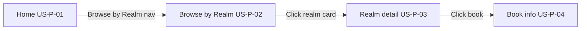
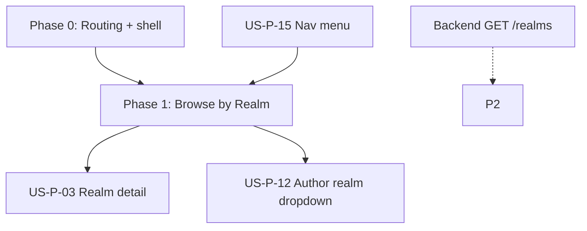

# US‑P‑02: Browse by Realm Page — Implementation Plan

## Story

**I, as a reader, want to see a page that lists all available fantasy/sci‑fi realms as clickable cards, for browsing books by thematic category.**

### Acceptance Criteria

```gherkin
Given I click “Browse by Realm” in the navigation
When the Browse by Realm page loads
Then I see a grid or list of realm cards
Each card displays a realm name (e.g., “Dragon Realms”, “Cyberpunk Wastelands”)
And each card is clickable and leads to the realm detail page
```

### Related Requirements

| ID | Requirement |
|----|-------------|
| **US‑P‑03** | Realm detail page (downstream — card destination) |
| **US‑P‑15** | Navigation menu (partial — “Browse by Realm” link) |
| **US‑R‑03 / FR‑R‑03** | Empty realm message on **detail** page, not browse |
| **FR‑C‑03** | Loading spinner/skeleton while page loads |
| **NFR‑1** | First contentful paint within 2 seconds |

---

## Journey Context

### Reader Journey 1 — Stages 2–3



- **Stage 2:** Reader explores thematic realms — cards must be **clearly labeled and distinct**.
- **Stage 3:** Card click lands on realm detail with books (US‑P‑03).
- **Recovery (Negative #4):** Realms with zero books still appear on browse; empty handling is on the detail page.

### Cross‑journey links

- **FR‑R‑02:** Empty search links to “Browse by Realm” — this page is a destination.
- **Author Journey 2, Stage 4:** Authors pick a realm when creating books — realms are a **shared catalogue entity**.

---

## Current Codebase (after Phase 0 + 1)

| Area | Status |
|------|--------|
| Angular 21 + Tailwind 4 + Vitest | In use |
| Routing | Configured via `app.routes.ts` |
| App shell | `AppShellComponent` with nav, footer, `<router-outlet>` |
| Home page | Extracted to `HomePage` — all original content preserved |
| Browse by Realm | Implemented at `/realms` |
| Realm detail | Minimal stub at `/realms/:slug` (US‑P‑03 placeholder) |
| Backend API | Not yet — `RealmService` uses in-memory seed data |

---

## Architecture

### File structure

```
FictioneersUI/src/app/
├── app.routes.ts
├── app.config.ts                    # provideRouter(routes)
├── app.ts                           # root → <app-shell />
├── layout/
│   └── app-shell/
│       ├── app-shell.component.ts
│       └── app-shell.component.html
├── features/
│   ├── home/
│   │   ├── home.page.ts
│   │   └── home.page.html
│   ├── browse-realms/
│   │   ├── browse-realms.page.ts
│   │   ├── browse-realms.page.html
│   │   └── browse-realms.page.spec.ts
│   └── realm-detail/                # stub for US-P-03
│       ├── realm-detail.page.ts
│       └── realm-detail.page.html
├── shared/
│   ├── components/
│   │   └── realm-card/
│   │       ├── realm-card.component.ts
│   │       ├── realm-card.component.html
│   │       └── realm-card.component.spec.ts
│   └── models/
│       └── realm.model.ts
└── core/
    └── services/
        ├── realm.service.ts
        └── realm.service.spec.ts
```

### Routes

| Path | Component | Story |
|------|-----------|-------|
| `''` | `HomePage` | US‑P‑01 |
| `realms` | `BrowseRealmsPage` | **US‑P‑02** |
| `realms/:slug` | `RealmDetailPage` | US‑P‑03 (stub) |

All feature routes are **lazy-loaded**.

### Data model

```typescript
export interface Realm {
  id: string;
  slug: string;           // URL-safe, e.g. 'cyberpunk-wastelands'
  name: string;             // e.g. 'Cyberpunk Wastelands'
  description?: string;     // one-line teaser on card
  bookCount?: number;       // optional badge
  imageUrl?: string;        // post-MVP card background
}
```

### Service layer

```typescript
// MVP: static in-memory list in RealmService
getRealms(): Observable<Realm[]>
getRealmBySlug(slug: string): Observable<Realm | undefined>

// Later: GET /api/realms, GET /api/realms/:slug
```

**Seed realms (9):** Hard Sci‑Fi, Space Opera, Epic Fantasy, Urban Fantasy, Cyberpunk Wastelands, Cosmic Horror, Solarpunk, Dragon Realms, Time Travel Archives (0 books — for empty-detail testing).

---

## UI / UX Design

### Browse page layout

1. **Page header** — `.section` + `.section-title`: “Browse by **Realm**” + subtitle.
2. **Realm grid** — `.realm-grid`: responsive auto-fill grid (min 280px columns).
3. **Realm card** — `.realm-card`: matches `.book-card` hover/border language.

### Realm card content (MVP)

- **Required:** realm name (`.realm-card__name`)
- **Recommended:** description, book count badge
- **Whole card clickable** via `routerLink` to `/realms/:slug`
- **Keyboard:** focusable link with visible focus ring
- **Responsive:** 1 col mobile (375px), 2+ tablet/desktop

### Loading (FR‑C‑03)

- Skeleton cards (`.realm-card--skeleton`) while `RealmService.getRealms()` resolves.
- Mock data uses 150ms delay to validate loading pattern for future API.

### Styles (global — `src/styles.scss`)

| Class | Purpose |
|-------|---------|
| `.realm-grid` | Responsive card grid |
| `.realm-card` | Clickable card with hover/focus |
| `.realm-card__name` | Realm title |
| `.realm-card__description` | Teaser text |
| `.realm-card__count` | Book count badge |
| `.realm-card--skeleton` | Loading placeholder |

### Out of scope for US‑P‑02

- Empty-state message for realms with no books → **US‑R‑03 / US‑P‑03**
- Realm icons/images → post‑MVP (Journey 1)
- Search, auth, full nav auth states → **US‑P‑06, US‑P‑09, US‑P‑15**

---

## Implementation Phases

### Phase 0 — Prerequisites (routing + shell) ✅ **Implemented successfully**

| Task | Status | Notes |
|------|--------|-------|
| Add `provideRouter(routes)` in `app.config.ts` | ✅ Done | |
| Extract `AppShellComponent` (nav, footer, `<router-outlet>`) | ✅ Done | |
| Extract `HomePage` from monolithic `app.html` | ✅ Done | All home sections preserved |
| Nav: “Browse by Realm” → `/realms` | ✅ Done | Existing nav links kept |
| Nav: “Home” + logo → `/` | ✅ Done | |
| Hero CTAs + “View All Realms” → `/realms` | ✅ Done | Journey alignment |

**Verification:** `ng build` succeeds; home page content unchanged; nav routes work.

---

### Phase 1 — Core US‑P‑02 ✅ **Implemented successfully**

| Task | Status | Notes |
|------|--------|-------|
| `Realm` model | ✅ Done | `shared/models/realm.model.ts` |
| `RealmService` + seed data | ✅ Done | `core/services/realm.service.ts` |
| `RealmCardComponent` | ✅ Done | Input: `realm`; links to `/realms/:slug` |
| `BrowseRealmsPage` | ✅ Done | Grid of cards + loading skeleton |
| Route `realms` (lazy) | ✅ Done | `app.routes.ts` |
| Realm styles | ✅ Done | `styles.scss` |
| Unit tests | ✅ Done | 12 tests passing |

**Verification:**

- [x] Click “Browse by Realm” in nav → `/realms` loads
- [x] Page shows grid of realm cards (not pills)
- [x] Every seeded realm appears with name visible
- [x] Click any card → navigates to `/realms/{slug}`
- [x] Works unauthenticated
- [x] Responsive layout (375px, 768px, desktop)
- [x] No home page content removed

---

### Phase 2 — Integration touchpoints ⏳ Pending

| Touchpoint | Action |
|------------|--------|
| Home category pills | Optional: link individual pills to matching `/realms/:slug` |
| Search empty state (US‑R‑02) | Link to `/realms` when search page exists |
| Author book form (US‑P‑12) | Reuse `RealmService` for realm dropdown |
| Backend API | Replace mock with `GET /api/realms` |

---

### Phase 3 — Tests & polish ⏳ Partially done

| Item | Status |
|------|--------|
| `browse-realms.page.spec.ts` | ✅ Done |
| `realm-card.component.spec.ts` | ✅ Done |
| `realm.service.spec.ts` | ✅ Done |
| `app.spec.ts` updated | ✅ Done |
| E2E / manual acceptance checklist | ⏳ Optional follow-up |

---

## Backend Contract (future)

```
GET /api/realms
→ 200 [{ id, slug, name, description?, bookCount? }]

GET /api/realms/:slug
→ 200 { id, slug, name, description?, bookCount? }
→ 404 if not found
```

Public, no auth. Frontend `RealmService` can swap mock → HTTP without changing page components.

---

## Dependencies & Sequencing



| Dependency | Relationship |
|------------|--------------|
| **US‑P‑15** (nav) | Partial — “Browse by Realm” link added; full auth-aware nav still pending |
| **US‑P‑01** (home) | Done alongside Phase 0 |
| **US‑P‑03** (realm detail) | Downstream — stub exists; full book list + empty state next |
| **US‑P‑12** (author form) | Shared `RealmService` / seed list |
| **FR‑R‑02** | Downstream — search links here |

**Suggested next step:** Implement **US‑P‑03** (realm detail with book grid + FR‑R‑03 empty state).

---

## Risks & Decisions

| Decision | Choice |
|----------|--------|
| Cards vs list | **Grid of cards** — matches book browsing and journey “scroll through realm cards” |
| Reuse `.category-pill`? | **No** — pills are home filters; browse page uses larger navigable cards |
| Show realms with 0 books? | **Yes** — e.g. Time Travel Archives; empty message on detail page |
| Lazy load routes? | **Yes** |
| New libraries? | **None** — Angular Router + existing Tailwind only |

---

## How to Run & Verify

```powershell
cd FictioneersUI
npm start
```

Open `http://localhost:4200/realms` or use **Browse by Realm** in the nav.

```powershell
npm run build   # production build
npm test        # unit tests (12 passing)
```

---

## Acceptance Verification Checklist (US‑P‑02)

Manual test against Gherkin:

- [x] Click “Browse by Realm” in navigation → `/realms` loads
- [x] Page shows a **grid** of cards
- [x] Every realm appears as a card with **name** visible
- [x] Click any card → navigates to `/realms/{slug}`
- [x] Page works unauthenticated
- [x] Layout acceptable at 375px, 768px, desktop
- [x] No home page content removed

Automated: Vitest specs pass; `ng build` succeeds.

**US‑P‑02 status: Complete (Phase 0 + Phase 1).**
